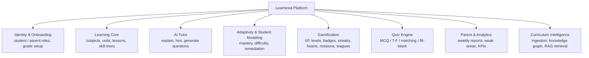

# Learnexia — Business Requirements Document (BRD)

> **Source basis:** Synthesized from the 15 product/architecture/UX documents in [info/](../info/). Every major claim traces to those files. Where they conflict or are silent, an **(open question)** or **(assumption)** note is added rather than inventing facts.
> **Related docs:** detailed requirements in [SRS.md](SRS.md) · execution plan in [BUSINESS_PLAN.md](BUSINESS_PLAN.md) · engineering tasks in [TASK_BREAKDOWN.md](TASK_BREAKDOWN.md) · existing backend in [architecture.md](architecture.md). The existing technical execution plan ([info/learnexia_brd_technical_execution_plan.md](../info/learnexia_brd_technical_execution_plan.md)) is referenced rather than duplicated.

## Table of Contents
1. [Vision & Problem Statement](#1-vision--problem-statement)
2. [Target Users & Personas](#2-target-users--personas)
3. [Business Goals & Success Metrics](#3-business-goals--success-metrics)
4. [Scope (In / Out)](#4-scope-in--out)
5. [Capabilities & High-Level Features](#5-capabilities--high-level-features)
6. [Stakeholders](#6-stakeholders)
7. [Constraints](#7-constraints)
8. [Assumptions](#8-assumptions)
9. [Risks](#9-risks)
10. [Open Questions](#10-open-questions)

---

## 1. Vision & Problem Statement

**Learnexia** is an **AI-powered, gamified, adaptive learning platform for school students**, positioned as a *full AI-native "Learning Operating System" that adapts, teaches, remembers, and evolves with each learner* — explicitly **not** a generic chatbot, a traditional LMS, a content library, or an "AI wrapper."

**Problem:** school learning is too often *boring, passive, and stressful*. Learnexia aims to make it *engaging, personalized, game-like, and rewarding* by combining AI tutoring, gamification (Duolingo-style habit loops), adaptive learning paths, and reinforcement.

**Differentiation:** engagement + adaptive AI personalization + behavioral/emotional design + an **Arabic-first** educational experience. A guiding insight from the source material: *"Success will not come from the strongest AI model, but from habit loops, gamification, emotional design, and personalized learning."*

## 2. Target Users & Personas

| Persona | Description | Needs |
|---|---|---|
| **Primary student** | Primary & middle-school students (ages ~6–14), Arabic-speaking (Egypt + Gulf) | Engaging daily learning, instant help, sense of progress |
| **Parent / guardian** | Wants measurable improvement and visibility | Weekly reports, weak-area alerts, simple progress view |

**Markets:** Egypt for MVP launch; Gulf region next (higher willingness to pay; British/American/IB curricula).

## 3. Business Goals & Success Metrics

| # | Goal | KPIs |
|---|---|---|
| **G1** | Increase student engagement | D1/D7 retention, WAU, sessions/day, session duration |
| **G2** | Improve learning outcomes | Quiz accuracy, mastery improvement, weak-area reduction |
| **G3** | Build a daily learning habit | Streak length, daily-mission completion rate |
| **G4** | Give parents visibility | Weekly report opens, weak-area engagement |
| **G5** | Build a scalable AI education platform | Architecture supports 100k+ users; reusable across grades/subjects/regions |

**Monetization:** freemium — **Free** (limited missions + limited AI tutoring) and **Premium** (unlimited tutoring, advanced analytics, personalized learning paths). *(open question: pricing, ARPU, and revenue targets are not specified in the source.)*

## 4. Scope (In / Out)

**In scope (MVP):**
- 5 subjects: **Math, Science, Arabic, English, Social Studies** (primary grades; Math gets deepest adaptivity first).
- AI Tutor (explanations, hints, follow-ups, simplification).
- Learning paths / skill trees with unlock progression.
- Gamification: XP, levels, badges, streaks, hearts, daily missions, leagues.
- Adaptive learning (difficulty/pacing/remediation) + student modeling.
- Quiz engine: MCQ, True/False, Matching, Fill-in-the-blank; adaptive quizzes.
- Parent dashboard: weekly reports, weak areas, progress.

**Out of scope (Phase 1):** video generation, voice AI, marketplace, multi-agent orchestration in core flows, real-time multiplayer, school/ERP integrations, autonomous AI systems. *(Teacher role/tools are excluded from the product entirely per current direction.)*

## 5. Capabilities & High-Level Features

Each capability maps to detailed functional requirements in [SRS.md §4](SRS.md). Curriculum Intelligence (H) is partly Phase 2+ but its data model is designed now.

## 6. Stakeholders

Minimum team (per source): **1 Product Owner, 1 Frontend Engineer, 1 Backend Engineer, 1 AI Engineer, 1 Product Designer**. External stakeholders: students, parents, and (later) schools. AI providers (OpenAI/Google) and cloud host are key vendor dependencies.

## 7. Constraints

- **Performance targets:** API < 500 ms; AI response < 4 s; 99.5% uptime; architecture for 100k+ users.
- **Timeline:** MVP planned at **9 weeks** across 6 phases (see [BUSINESS_PLAN.md](BUSINESS_PLAN.md)).
- **Child safety is non-negotiable:** content moderation, restricted prompts, age-appropriate output, hallucination minimization.
- **Localization:** Arabic-first with English; RTL support required.
- **Phase-1 simplicity:** no multi-agent orchestration, video, or voice in core flows.
- **Confirmed stack:** database is **PostgreSQL** (+ pgvector for RAG); backend is **.NET 10** (modular monolith, reusing `backend` patterns).

## 8. Assumptions

- High AI-tool adoption among students in Egypt; no dominant AI learning platform yet in Egypt/Gulf.
- **RAG + curriculum intelligence over fine-tuning** for MVP (cheaper, dynamic, easy to update); fine-tuning only later for teaching-style consistency.
- Rewarding sessions are **< 10 minutes**; daily missions + streaks drive habit formation.
- Deterministic engines make learning *decisions*; AI only *generates content* (explanations/hints/questions) — a core architectural assumption from the source.

## 9. Risks

| Risk | Mitigation (from source) |
|---|---|
| AI cost at scale | Model routing (cheap vs. premium), RAG over fine-tuning |
| Latency in AI/agent workflows | Keep agents out of core loop (Phase 2 background only) |
| Large-scale vector search cost | Efficient embeddings (BGE-M3), pgvector |
| Child safety / unsafe output | Mandatory AI Safety Layer, restricted prompts |
| Hallucination | Curriculum-grounded RAG, age-appropriate prompt templates |
| **DB migration effort** | Decision made: target DB is **PostgreSQL** (+ pgvector), stack **.NET 10**. The current `backend` runs on **SQL Server**, so Identity + new modules must be provisioned on PostgreSQL — a one-time migration, no longer an open architectural question. See [SRS.md §7](SRS.md). |

## 10. Open Questions

1. Which curriculum standard(s) for MVP — Egyptian national, international, or multiple?
2. Primary AI provider: OpenAI GPT vs. Google Gemini (both mentioned)?
3. Pricing / ARPU / financial targets?
4. COPPA-style parental consent / age verification for under-13 users?
5. English-language scope vs. Arabic-first rollout sequencing?

> **Resolved:** DB = **PostgreSQL** (+ pgvector); stack = **.NET 10**; **no teacher role/tools** in the product.
> **Resolved (streak/hearts mechanics):** the daily-habit mechanic is **streak freeze** (FR-GM-9 / story P4-11) — a limited, earnable/spendable freeze auto-consumes to preserve a streak on a missed day — rather than an open-ended grace window. Hearts regeneration uses a configurable timed/practice-based refill (FR-GM-3). The exact dials (freeze inventory, regen interval, event cadence) are **config-driven and tunable**, not launch blockers. See [docs/briefs/barrier-to-entry-gap-analysis.md](briefs/barrier-to-entry-gap-analysis.md).
