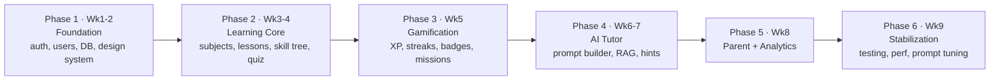

# Learnexia — Business Plan for Execution

> **Basis:** [BRD.md](BRD.md) + [SRS.md](SRS.md), synthesizing [info/](../info/) (notably the 9-week technical execution plan and the architecture-decision docs). Financial figures (pricing/ARPU) are **not** in the source and are flagged as open.

## Table of Contents
1. [Executive Summary](#1-executive-summary)
2. [Phased Roadmap & Milestones](#2-phased-roadmap--milestones)
3. [Team & Roles](#3-team--roles)
4. [Build vs. Buy / Open-Source Stack](#4-build-vs-buy--open-source-stack)
5. [Cost & Resource Considerations](#5-cost--resource-considerations)
6. [Go-to-Market](#6-go-to-market)
7. [Delivery Risks](#7-delivery-risks)
8. [Success Criteria per Phase](#8-success-criteria-per-phase)

---

## 1. Executive Summary

Build and launch the Learnexia MVP — an AI-tutored, gamified, adaptive learning app for Arabic-speaking primary/middle students — in a **9-week, 6-phase** plan with a **5-person core team**. Strategy: ship a habit-forming learning loop (skill trees + gamification + AI tutor) for 5 subjects, prove engagement/retention KPIs in **Egypt**, then expand adaptivity and the **Gulf** market. Engineering leans on proven open-source for ingestion/RAG/OCR and **builds** the differentiated engines (gamification, learning paths, adaptivity, student modeling).

## 2. Phased Roadmap & Milestones

**MVP (9 weeks):** the 6 phases above, mapping directly to [info/learnexia_brd_technical_execution_plan.md](../info/learnexia_brd_technical_execution_plan.md).

**Post-MVP roadmap:**
- **Phase 2 (product):** deep adaptivity, voice tutoring.
- **Phase 3:** agentic background workflows (Hermes), curriculum intelligence at scale, AI-generated learning plans, explicit knowledge graph (Neo4j).
- **Phase 4:** school integrations, classroom management, **Gulf regional expansion** (multi-curriculum: British/American/IB).

## 3. Team & Roles

| Role | MVP responsibility |
|---|---|
| **Product Owner** | Backlog, scope control, KPI ownership, curriculum decisions |
| **Frontend Engineer** | Next.js PWA / React Native, design-system build, gamified UX, animations |
| **Backend Engineer** | Modular monolith, auth, learning/quiz/gamification modules, event-driven pipeline |
| **AI Engineer** | AI Gateway (FastAPI), prompt builder, RAG retrieval, safety layer, model routing |
| **Product Designer** | Figma design system, kid-friendly screens, motion specs |

Scaling past MVP: add QA, a second backend engineer for the curriculum-intelligence pipeline, and (Phase 2) a data/ML engineer for adaptivity tuning.

## 4. Build vs. Buy / Open-Source Stack

From [info/Learnexia_OpenSource_Architecture_Repos.md](../info/Learnexia_OpenSource_Architecture_Repos.md):

| Layer | Decision | Choice |
|---|---|---|
| Curriculum ingestion | **Buy/OSS** | RAGFlow |
| Multimodal parsing | **Buy/OSS** | RAG-Anything |
| Knowledge graph retrieval | **Buy/OSS** | LightRAG (Phase 2+) |
| OCR (Arabic, scanned PDFs) | **Buy** | Azure Document Intelligence |
| Embeddings | **Buy/OSS** | BGE-M3 (multilingual) or OpenAI |
| Vector DB | **Buy/OSS** | PostgreSQL + pgvector |
| LLM | **Buy** | OpenAI GPT / Google Gemini (routed) |
| **AI Tutor logic** | **Build** | Custom (DeepTutor-inspired patterns) |
| **Gamification engine** | **Build** | XP/badges/streaks/missions (rule-based, event-driven) |
| **Learning Path engine** | **Build** | Skill-tree navigation, unlock logic (deterministic) |
| **Adaptivity + Student Modeling** | **Build** | Rule-based difficulty/pacing + mastery tracking |

**Principle:** don't build OCR, ingestion, chunking, embeddings, or vector search; **do** build the differentiated educational engines.

## 5. Cost & Resource Considerations

- **AI inference is the main variable cost.** Control via: model routing (cheap model for hints/simple explanations, premium for hard reasoning), RAG over fine-tuning, caching frequent explanations, and capping free-tier AI usage.
- **Vector search/storage** scales with curriculum volume — pgvector keeps it on the primary DB initially (no separate vector-DB cost).
- **Hosting (MVP):** Azure / Railway / Render; move to Kubernetes + multi-region only when scale demands.
- **Freemium funds premium AI:** free tier limits missions + AI tutoring; premium unlocks unlimited tutoring + analytics + personalized paths. *(open: pricing/ARPU not specified.)*

## 6. Go-to-Market

- **Launch market:** Egypt (high AI-tool adoption among students; no dominant AI learning platform yet).
- **Wedge:** Arabic-first, gamified, sub-10-minute daily sessions → habit formation; parents as the paying buyer with weekly visible progress.
- **Expansion:** Gulf region (higher willingness to pay, multi-curriculum demand) once retention KPIs are proven.
- *(open question: specific channels, CAC, and partnerships are not detailed in the source.)*

## 7. Delivery Risks

| Risk | Impact | Mitigation |
|---|---|---|
| **DB migration** (current SQL Server → target **PostgreSQL**) | Rework if late | Decided up front: switch EF provider to Npgsql in P1, reuse backend patterns; stack stays **.NET 10** (see [SRS §7](SRS.md)) |
| AI cost overrun | Margin erosion | Model routing, caching, free-tier caps |
| Child-safety failure | Trust/legal | Mandatory safety layer (FR-AI-4), restricted prompts |
| Curriculum content gap | Weak tutoring | Confirm curriculum source early; ingest before AI phase |
| 9-week timeline optimism | Scope cut | Strict MVP scope; gamification + AI tutor are the must-haves |
| Single AI provider dependency | Outage/price risk | Abstract provider behind AI Gateway; support GPT + Gemini |

## 8. Success Criteria per Phase

| Phase | Done when… |
|---|---|
| 1 Foundation | A user can register/login; design system + auth screens live; DB provisioned |
| 2 Learning Core | A student can browse subjects, open a lesson, navigate a skill tree, take a quiz |
| 3 Gamification | XP/streaks/badges/missions fire on learning events and are visible in UI |
| 4 AI Tutor | The tutor explains/ hints/ generates questions grounded in curriculum, behind the safety layer |
| 5 Parent + Analytics | A parent sees a weekly report with weak areas; KPI events are captured |
| 6 Stabilization | Performance targets met (NFR-1), prompts tuned, critical bugs cleared → launch-ready |
