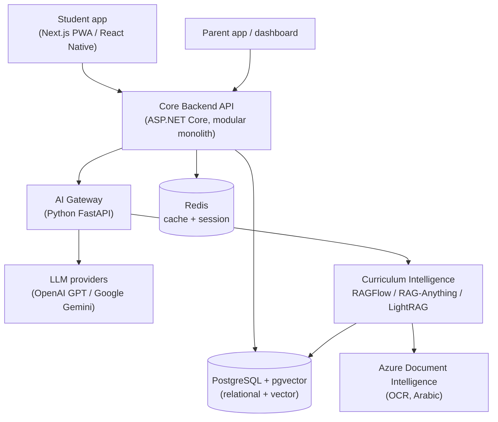
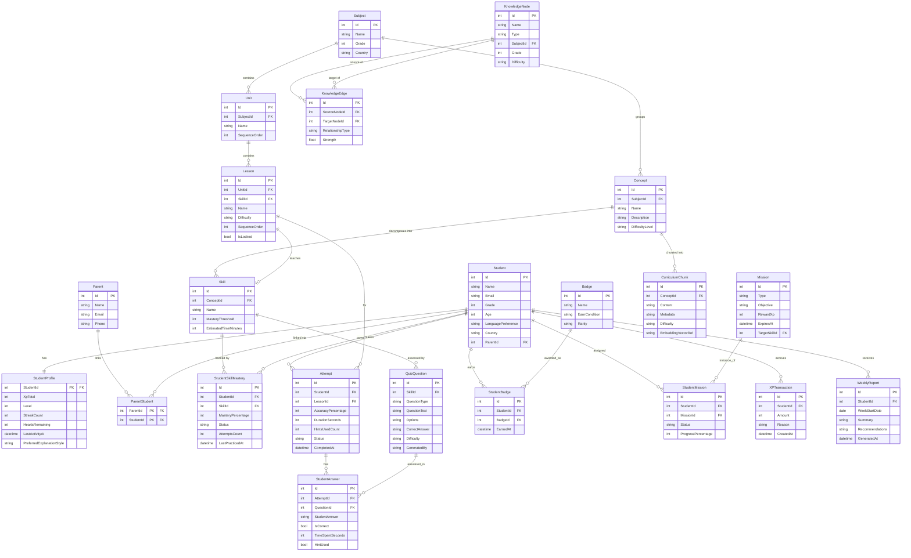

# Learnexia — Software Requirements Specification (SRS)

> **Derived from:** [BRD.md](BRD.md), synthesizing [info/](../info/). Functional requirements are numbered `FR-x`, grouped by module, and traced back to BRD goals (G1–G5) in [§8](#8-requirements-traceability). Non-functional requirements are `NFR-x`.
> **Data model note:** the source `info/` files contain **no database schema** — the model in [§6](#6-proposed-data-model--erd) is *proposed*, derived from the curriculum/adaptivity/AI/knowledge-graph docs, and reconciled against the existing [backend schema](architecture.md) in [§7](#7-reconciliation-with-existing-backend).

## Table of Contents
1. [Purpose & Scope](#1-purpose--scope)
2. [System Context](#2-system-context)
3. [User Roles & Permissions](#3-user-roles--permissions)
4. [Functional Requirements](#4-functional-requirements)
5. [Non-Functional Requirements](#5-non-functional-requirements)
6. [Proposed Data Model / ERD](#6-proposed-data-model--erd)
7. [Reconciliation with Existing backend](#7-reconciliation-with-existing-backend)
8. [Requirements Traceability](#8-requirements-traceability)

---

## 1. Purpose & Scope

Specify the software requirements for the Learnexia MVP: an AI-tutored, gamified, adaptive learning app for Arabic-speaking primary/middle students, plus a parent dashboard. Scope matches [BRD §4](BRD.md). Phase-2+ items (voice/video, agentic workflows) are noted but not specified in detail. **There is no teacher role in the product.** Confirmed platform decisions: **PostgreSQL** (+ pgvector) and **.NET 10**.

## 2. System Context

## 3. User Roles & Permissions

| Role | Can | Cannot |
|---|---|---|
| **Student** | Learn, take quizzes, ask AI tutor, earn XP/badges, view own profile/leagues | See other students' private data, access parent reports |
| **Parent** | View linked child's reports/weak-areas/progress, manage account | Access learning content as a learner, see other families |
| **Admin** | Manage curriculum upload, subjects, content moderation config | — |

Roles build on the existing Identity module's role/permission model (see [architecture.md §9](architecture.md)). **No teacher role exists.**

## 4. Functional Requirements

### 4.1 Identity & Onboarding (`FR-ID`)
- **FR-ID-1** The system shall register and authenticate students and parents (email/password, JWT), with role selection (Student/Parent). *(G1)*
- **FR-ID-2** Onboarding shall capture grade (1–6), language preference (Arabic/English), and country. *(G2,G5)*
- **FR-ID-3** Parents shall link to one or more student accounts. *(G4)*
- **FR-ID-4** The system shall support token refresh and sign-out/session termination. *(G1)*

### 4.2 Learning Core (`FR-LR`)
- **FR-LR-1** The system shall model curriculum as **Grade → Subject → Unit → Lesson → Skill**. *(G2,G5)*
- **FR-LR-2** Students shall navigate a **skill tree** with node states: locked, unlocked, completed, boss. *(G1,G2)*
- **FR-LR-3** Lessons shall unlock based on mastery/prerequisite rules from the Learning Path Engine. *(G2)*
- **FR-LR-4** A lesson shall present an AI explanation, visual example, and an embedded quick check. *(G1,G2)*

### 4.3 AI Tutor (`FR-AI`)
- **FR-AI-1** The tutor shall explain a concept on demand, age- and grade-appropriately, in the student's language. *(G2)*
- **FR-AI-2** The tutor shall provide progressive hints on wrong answers and a simplified re-explanation. *(G2)*
- **FR-AI-3** The tutor shall generate practice/quiz questions grounded in retrieved curriculum context (RAG). *(G2)*
- **FR-AI-4** A **Safety Layer** shall filter AI output for toxicity, age-appropriateness, and hallucination before display. *(G2)* — **mandatory**.
- **FR-AI-5** A Prompt Builder shall inject grade, age, language, curriculum context, weak areas, and child-safe tone. *(G2)*
- **FR-AI-6** AI shall **not** decide progression, difficulty, or unlocking — only generate content (per architecture principle). *(G2)*

### 4.4 Adaptivity & Student Modeling (`FR-AD`)
- **FR-AD-1** The Adaptivity Engine shall adjust difficulty (easy/medium/hard) from accuracy, response time, retry count, and hint usage. *(G2)*
- **FR-AD-2** The Student Modeling Engine shall track per-skill mastery % and status (not_started/in_progress/mastered/needs_review). *(G2)*
- **FR-AD-3** Mastery shall be rule-based: ≥80% = mastered, <50% = needs remediation. *(G2)*
- **FR-AD-4** The system shall schedule spaced-repetition reinforcement on weak/forgotten skills. *(G2,G3)*
- **FR-AD-5** The system shall derive an **adaptive student (behavioral) profile** from captured signals — question-type affinity, recurring-error clusters, attention-span/session-fatigue, and a derived `PreferredExplanationStyle` — using **rule-based, explainable** logic, and expose it to the Prompt Builder (FR-AI-5) and Adaptivity Engine (FR-AD-1). *(G2,G3)* — *(barrier-to-entry BE2; see story P3-13.)*

### 4.5 Quiz Engine (`FR-QZ`)
- **FR-QZ-1** Support question types: MCQ, True/False, Matching, Fill-in-the-blank. *(G2)*
- **FR-QZ-2** Validate answers and give instant feedback (correct → XP/streak; wrong → hint/heart loss). *(G1,G2)*
- **FR-QZ-3** Quizzes shall be adaptive in difficulty per student model. *(G2)*
- **FR-QZ-4** Record granular per-question answers (correctness, time spent, hint used). *(G2,G5)*

### 4.6 Gamification (`FR-GM`)
- **FR-GM-1** Award XP per event (e.g., correct +10, quiz +20, lesson +50, streak bonus +30) and compute level. *(G1,G3)*
- **FR-GM-2** Maintain streaks with daily activity; surface streak state. *(G3)* — *(streak preservation handled by **streak freeze**, FR-GM-9, not an open grace window; dials are config-driven.)*
- **FR-GM-3** Hearts system: limited hearts/session, −1 on wrong answer; on depletion enter Practice Mode. *(G1)* — *(regeneration is a config-driven timed/practice-based refill; dials tunable, not a blocker.)*
- **FR-GM-4** Award badges by rule (skill mastered, N-day streak, quiz master, etc.). *(G1,G3)*
- **FR-GM-5** Daily/weekly **missions** with objectives and rewards. *(G3)*
- **FR-GM-6** Weekly **leagues** (Bronze→Silver→Gold→Diamond) with promotion/demotion. *(G1)*
- **FR-GM-7** Gamification shall be **event-driven**: a `LessonCompleted`/`AnswerSubmitted` event fans out to XP, badge, streak, analytics handlers. *(G5)* — *(realtime read model: XP totals, streak counters, and league leaderboards are served from **Redis** in the hot path with **PostgreSQL as the durable ledger**, meeting NFR-1; see story P4-10.)*
- **FR-GM-8** The system shall send **student re-engagement notifications** — streak-at-risk, daily-mission reminder, and lapse win-back — under **parent-controlled** per-child opt-in, quiet hours, and a daily cap; copy is Arabic-first, child-safe, and never shaming. *(G1,G3)* — *(barrier-to-entry BE4; see story P4-09.)*
- **FR-GM-9** The Daily Habit System shall provide **streak freeze** (consumed to preserve a streak on a missed day), **timed events** (scheduled limited-window challenges with rewards), and recurring **weekly challenges**, all granting rewards through the existing XP/badge engine. *(G1,G3)* — *(resolves the FR-GM-2/FR-GM-3 open dials; see story P4-11.)*

### 4.7 Parent & Analytics (`FR-PA`)
- **FR-PA-1** Generate weekly reports per student (XP earned, skills improved, weak areas, recommendations). *(G4)*
- **FR-PA-2** Surface detected weak areas with severity. *(G4)*
- **FR-PA-3** Collect analytics: DAU/WAU, session duration, mission completion, quiz accuracy, retention, subject engagement. *(G1,G5)*
- **FR-PA-4** The system shall **feed aggregate outcome data back** to recalibrate per-question empirical difficulty, flag low-quality AI-generated questions for review, and tune adaptivity thresholds (config-driven, auditable, reversible), operating on **de-identified aggregates**. *(G2,G5)* — *(barrier-to-entry BE7 "data network effect"; see story P5-07.)*

### 4.8 Curriculum Intelligence (`FR-CI`) — *Phase 2+, modeled now*
- **FR-CI-1** Admins shall upload curriculum (PDF/DOCX/images) with metadata (grade/subject/language/country). *(G5)*
- **FR-CI-2** Documents shall be OCR'd (Arabic-capable), structured into the curriculum hierarchy, and semantically chunked. *(G5)*
- **FR-CI-3** Build a knowledge graph of concepts/skills with prerequisite/related edges. *(G2,G5)* — *(an **MVP slice** of this — a hand-authored, relational, acyclic skill dependency graph using `KnowledgeNode`/`KnowledgeEdge` — is pulled forward to Phase 2 to back prerequisite unlocks and remediation without the OCR pipeline; see story P2-11.)*
- **FR-CI-4** Store chunk embeddings in a vector store for retrieval by the AI tutor. *(G2,G5)*

## 5. Non-Functional Requirements

| ID | Category | Requirement |
|---|---|---|
| **NFR-1** | Performance | Core API responses < 500 ms (p95); AI tutor responses < 4 s. |
| **NFR-2** | Scalability | Architecture supports 100k+ users; event-driven background processing for gamification/analytics. |
| **NFR-3** | Availability | 99.5% uptime target. |
| **NFR-4** | Security | JWT auth, role/permission authorization, encrypted secrets, child-data protection; AI Safety Layer mandatory. |
| **NFR-5** | Localization | Arabic-first + English; RTL layouts; Cairo/Tajawal (Arabic) and Poppins (English) fonts. |
| **NFR-6** | Accessibility (kids) | Large touch targets, one primary action/screen, minimal text, high contrast, visual feedback on every action. |
| **NFR-7** | Usability | Rewarding sessions < 10 minutes; instant feedback; gamified reinforcement. |
| **NFR-8** | Maintainability | Modular monolith, clean architecture, CQRS; deterministic engines separated from probabilistic AI. |
| **NFR-9** | Cost | Model routing (cheap vs. premium), RAG over fine-tuning, efficient embeddings to control AI/vector cost. |
| **NFR-10** | Compliance | Parental consent / age-appropriate handling for under-13 *(open question — see BRD §10)*. |

## 6. Proposed Data Model / ERD

Derived from the adaptivity, curriculum, knowledge-graph, and gamification docs. **This is a target model, not the current schema.** Identity reuses the existing `identity` schema (see §7). Grouped logically; a single ERD follows.

**Entity summary (selected):**

| Entity | Purpose | Key relationships |
|---|---|---|
| Student / StudentProfile | Learner identity + gamification state | 1–1; linked to Parent |
| Subject/Unit/Lesson/Concept/Skill | Curriculum hierarchy | Grade→Subject→Unit→Lesson→Skill; Concept↔Skill |
| StudentSkillMastery | Per-skill mastery tracking (SME) | Student × Skill |
| Attempt / StudentAnswer | Learning interactions (granular) | Attempt → many answers |
| QuizQuestion | AI-generated or curated items | per Skill |
| XPTransaction / Badge / StudentBadge / Mission / StudentMission | Gamification ledger | event-driven writes |
| WeeklyReport | Parent analytics | per Student/week |
| KnowledgeNode / KnowledgeEdge | Knowledge graph (concepts/skills + prereqs); **hand-authored relational slice in MVP (P2-11)** | self-referential graph |
| CurriculumChunk | RAG retrieval unit + embedding | per Concept; vector store |
| StudentLearningProfile | Derived **behavioral** model: question-type affinity, recurring-error clusters, attention-span signal, `PreferredExplanationStyle` (FR-AD-5) | per Student; rule-derived from Attempt/StudentAnswer |
| StreakFreeze / TimedEvent / WeeklyChallenge | Daily-habit mechanics (FR-GM-9): freeze inventory, scheduled events, recurring weekly goals | per Student / global schedule |
| NotificationPreference / NotificationLog | Parent-controlled per-child re-engagement settings + send/open audit (FR-GM-8) | per ParentStudent; feeds analytics |
| QuestionDifficultyStat | Aggregated empirical difficulty + quality flags driving calibration (FR-PA-4) | per QuizQuestion; de-identified aggregate |

> **(assumption)** Integer surrogate keys are used to match the existing Identity module (int keys). `EmbeddingVectorRef` maps to a **pgvector** column in **PostgreSQL** (confirmed DB). The knowledge graph is relational here (Phase 2 explicit), migrating to a graph DB (Neo4j/LightRAG) only in Phase 3+.

## 7. Reconciliation with Existing backend

The current [backend](architecture.md) is a **.NET 10 modular monolith on SQL Server** with three modules; the target moves persistence to **PostgreSQL** (keeping .NET 10). Mapping the proposed model onto it:

| Proposed area | Existing in backend? | Action |
|---|---|---|
| Student/Parent identity, roles, auth | **Yes** — `identity` schema (`AspNetUsers`, roles, refresh tokens) | **Extend** `User` with grade/age/language/country; add Parent linkage. Reuse JWT/session. |
| Subject/Unit/Lesson/Concept/Skill | **No** (Catalog has only Product/Category demo) | **New** `learning` module + schema. |
| StudentSkillMastery, Attempt, StudentAnswer | **No** | **New** `learning`/`assessment` module. |
| QuizQuestion / Quiz engine | **No** | **New** `assessment` module. |
| XP/Badges/Streaks/Missions/Leagues | **No** | **New** `gamification` module (event-driven). |
| WeeklyReport / analytics | **Notifications** module exists (send-notification scaffold) | **New** `analytics`/`parent` module; reuse Notifications for delivery. |
| KnowledgeNode/Edge, CurriculumChunk + embeddings | **No** | **New** `curriculum` module; **requires vector support**. |

**DB engine & vector search — decided:**
- **Database = PostgreSQL** (+ **pgvector** for RAG embeddings). **Stack = .NET 10** (modular monolith, clean architecture, CQRS — reuse `backend` patterns).
- **Migration required:** the current `backend` runs on **SQL Server**, so the EF Core provider must switch to **Npgsql (PostgreSQL)** and the Identity + new module schemas be provisioned there. This is a one-time migration, not an open question.
- The existing Catalog `Product/Category` is demo scaffolding and is **replaced** by the `learning` module.

## 8. Requirements Traceability

| BRD Goal | Functional Requirements |
|---|---|
| **G1** Engagement | FR-ID-1/4, FR-LR-2, FR-QZ-2, FR-GM-1/3/6/8/9, FR-PA-3 |
| **G2** Learning outcomes | FR-ID-2, FR-LR-1/3/4, FR-AI-1..6, FR-AD-1..5, FR-QZ-1/3/4, FR-CI-3/4, FR-PA-4 |
| **G3** Daily habit | FR-AD-4/5, FR-GM-1/2/4/5/8/9 |
| **G4** Parent visibility | FR-ID-3, FR-PA-1/2 |
| **G5** Scalable platform | FR-ID-2, FR-LR-1, FR-GM-7, FR-PA-3/4, FR-CI-1..4 |
