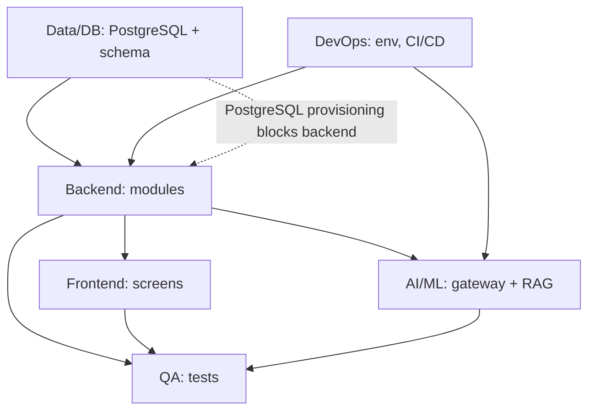

# Learnexia — Engineering Task Breakdown

> **Basis:** [SRS.md](SRS.md) (FR-/NFR- IDs), [BUSINESS_PLAN.md](BUSINESS_PLAN.md) phases, and the existing [backend architecture](architecture.md). Tasks are grouped by track (Frontend, Backend, AI/ML, Data/DB, DevOps, QA), organized as **epics → tasks**, tagged with the SRS requirement they satisfy, a target **phase (P1–P6)**, and dependencies. MVP-first ordering.

## Table of Contents
1. [Cross-Track Sequencing](#1-cross-track-sequencing)
2. [Backend](#2-backend)
3. [Frontend](#3-frontend)
4. [AI / ML](#4-ai--ml)
5. [Data / DB](#5-data--db)
6. [DevOps](#6-devops)
7. [QA](#7-qa)
8. [Priority Matrix](#8-priority-matrix)

---

## 1. Cross-Track Sequencing

> **Confirmed:** DB = **PostgreSQL** (+ pgvector), stack = **.NET 10**. P1 work is **provisioning + EF→Npgsql migration**, not a decision ([SRS §7](SRS.md)).

## 2. Backend

**Epic B1 — Foundation & Identity (P1)** *(FR-ID-1..4)*
- B1.1 Confirm/adapt modular-monolith host (reuse backend `Learnexia.Host`); switch EF Core provider to **Npgsql**. *dep: D1*
- B1.2 Extend `User` entity: grade, age, languagePreference, country. *(FR-ID-2)*
- B1.3 Add Parent role + `ParentStudent` linkage; parent registration. *(FR-ID-3)*
- B1.4 Reuse JWT auth/refresh/sign-out + session (already in Identity module). *(FR-ID-1/4)*

**Epic B2 — Learning module (P2)** *(FR-LR-1..4)*
- B2.1 New `learning` module + schema: Subject/Unit/Lesson/Concept/Skill entities + migrations.
- B2.2 CRUD + query endpoints (subjects, lessons, skill tree). *(FR-LR-1/2)*
- B2.3 Learning Path Engine: prerequisite/unlock rules (deterministic). *(FR-LR-3)*
- B2.4 Lesson assembly endpoint (explanation + visual + quick check). *(FR-LR-4)* *dep: AI A2*

**Epic B3 — Assessment / Quiz module (P2)** *(FR-QZ-1..4)*
- B3.1 QuizQuestion + Attempt + StudentAnswer entities. 
- B3.2 Answer validation + instant feedback; record granular answers. *(FR-QZ-2/4)*
- B3.3 Adaptive quiz selection hook (calls Adaptivity). *(FR-QZ-3)* *dep: B4*

**Epic B4 — Adaptivity & Student Modeling (P3)** *(FR-AD-1..4)*
- B4.1 StudentSkillMastery store + mastery rules (≥80%/<50%). *(FR-AD-2/3)*
- B4.2 Adaptivity Engine: difficulty from accuracy/time/retries/hints. *(FR-AD-1)*
- B4.3 Spaced-repetition scheduler for weak skills. *(FR-AD-4)*

**Epic B5 — Gamification module (P4, event-driven)** *(FR-GM-1..7)*
- B5.1 Domain events (`LessonCompleted`, `AnswerSubmitted`) + MediatR handlers. *(FR-GM-7)*
- B5.2 XP/level engine + XPTransaction ledger. *(FR-GM-1)*
- B5.3 Streak engine + hearts. *(FR-GM-2/3)*
- B5.4 Badge engine (rule-based) + StudentBadge. *(FR-GM-4)*
- B5.5 Missions (daily/weekly) + StudentMission. *(FR-GM-5)*
- B5.6 Leagues + weekly promotion/demotion job. *(FR-GM-6)* *dep: DevOps D-jobs*

**Epic B6 — Parent & Analytics (P5)** *(FR-PA-1..3)*
- B6.1 Weekly report generator (XP, improved skills, weak areas, recommendations). *(FR-PA-1)*
- B6.2 Weak-area detection + severity. *(FR-PA-2)*
- B6.3 Analytics event capture (DAU/WAU, sessions, accuracy, retention). *(FR-PA-3)*
- B6.4 Reuse Notifications module for report delivery.

**Epic B7 — Curriculum module (Phase 2+, schema in P3)** *(FR-CI-1..4)*
- B7.1 CurriculumChunk + KnowledgeNode/Edge entities + migrations.
- B7.2 Upload + metadata endpoints. *(FR-CI-1)*
- B7.3 Knowledge-graph build/query API. *(FR-CI-3)*

## 3. Frontend

**Epic F1 — Design system & foundation (P1)** *(NFR-5/6, FR-ID)*
- F1.1 Set up Next.js PWA / React Native + TypeScript, Tailwind/NativeWind, design tokens (colors, typography, radius, spacing per UI docs).
- F1.2 Core components: Button, Card, XP bar, Hearts, Streak, Badge, AI Tutor bubble, Reward popup.
- F1.3 Fonts + **RTL/Arabic** layout + locale switch (Poppins / Cairo / Tajawal). *(NFR-5)*
- F1.4 Auth screens: Splash, Role Selection, Login/Register, Grade Selection. *(FR-ID-1/2)*

**Epic F2 — Learning screens (P2)** *(FR-LR)*
- F2.1 Home Dashboard (XP, streak, daily mission, continue, league preview).
- F2.2 Subject Selection + Skill Tree (locked/unlocked/completed/boss nodes). *(FR-LR-2)*
- F2.3 Lesson screen (AI bubble, visual area, hearts/streak display). *(FR-LR-4)*

**Epic F3 — Quiz & feedback screens (P2/P3)** *(FR-QZ, FR-AI-2)*
- F3.1 Quiz screen (progress, question card, answer buttons, instant feedback).
- F3.2 Correct/Wrong answer screens (confetti / hint + heart loss). *(FR-QZ-2)*

**Epic F4 — AI tutor UI (P3)** *(FR-AI-1/2)*
- F4.1 Ask-AI / interactive explanation UI with typing animation.
- F4.2 Hint bubbles + simplified re-explanation flow.

**Epic F5 — Gamification screens (P4)** *(FR-GM)*
- F5.1 Reward screen, Badge collection, League, Missions, Hearts/Practice mode.
- F5.2 Motion specs: XP fill, badge pop-in, confetti, shake, animated flame. *(NFR-6/7)*

**Epic F6 — Parent dashboard (P5)** *(FR-PA)*
- F6.1 Parent dashboard: weekly report, weak areas, progress charts, recommendations.

## 4. AI / ML

**Epic A1 — AI Gateway (P3)** *(NFR-2/9)*
- A1.1 Python FastAPI gateway between .NET backend and LLMs; provider abstraction (GPT + Gemini) with model routing.
- A1.2 Safety Layer: toxicity/age-appropriateness/hallucination filtering. *(FR-AI-4, mandatory)*

**Epic A2 — Prompt Builder & Tutor (P3)** *(FR-AI-1/2/3/5/6)*
- A2.1 Prompt Builder: inject grade/age/language/curriculum context/weak areas/child-safe tone. *(FR-AI-5)*
- A2.2 Explain / hint / simplify endpoints. *(FR-AI-1/2)*
- A2.3 Question generation grounded in retrieved context. *(FR-AI-3)*
- A2.4 Subject-specific templates (Math step-by-step; Science visual; Languages vocab/grammar; Social storytelling).

**Epic A3 — RAG retrieval (P3)** *(FR-AI-3, FR-CI-4)*
- A3.1 Retrieval over curriculum chunks (student grade/subject/weak-area filtered).
- A3.2 Embeddings (BGE-M3 / OpenAI) + pgvector query.

**Epic A4 — Curriculum Intelligence pipeline (Phase 2+)** *(FR-CI-1..4)*
- A4.1 Ingestion via RAGFlow; OCR via Azure Document Intelligence (Arabic).
- A4.2 Curriculum structuring (PDF → hierarchy) + semantic chunking.
- A4.3 Knowledge-graph builder (LightRAG); concept/skill/prereq edges.

## 5. Data / DB

**Epic D1 — PostgreSQL provisioning & migration (P1, blocker)** *(NFR-2, SRS §7)*
- D1.1 Provision **PostgreSQL + pgvector** + Redis; switch EF Core provider from SQL Server to **Npgsql**.
- D1.2 Configure per-module schemas/migrations on PostgreSQL.

**Epic D2 — Schema implementation (P2–P3)** *(SRS §6)*
- D2.1 Identity extensions + Parent linkage.
- D2.2 Learning + Assessment schemas (Subject…Skill, Attempt, StudentAnswer, QuizQuestion).
- D2.3 Gamification schema (XP, Badge, Streak, Mission, League).
- D2.4 Curriculum + knowledge-graph schema + vector column. *(FR-CI)*
- D2.5 Seed data: 5 subjects, sample skill trees per grade.

## 6. DevOps

**Epic O1 — Environments & CI/CD (P1)** *(NFR-3)*
- O1.1 Docker compose for API + DB + Redis (+ MinIO if needed); align with existing [docker/](../docker/).
- O1.2 CI pipeline (build/test); deploy to Azure/Railway/Render.
- O1.3 Background jobs infra (Hangfire/Quartz) for streaks/leagues/reports. *dep: B5.6, B6*
- O1.4 Secrets management (move JWT secret out of appsettings — see architecture.md §14).

**Epic O2 — Observability (P5/P6)** *(architecture.md §15 gaps)*
- O2.1 Add `nlog.config` targets; wire OpenTelemetry (currently referenced, unused).
- O2.2 Health checks + KPI/analytics dashboards. *(FR-PA-3)*

## 7. QA

**Epic Q1 — Test foundation (P1+, continuous)**
- Q1.1 Unit tests per module (reuse existing test projects pattern).
- Q1.2 Integration tests for auth, learning, quiz flows.
- Q1.3 AI safety eval set (age-appropriateness, hallucination spot-checks). *(FR-AI-4)*
- Q1.4 Performance tests vs. NFR-1 (API <500ms, AI <4s).
- Q1.5 Localization/RTL test pass (Arabic). *(NFR-5)*
- Q1.6 P6 stabilization: regression, prompt tuning validation, bug triage.

## 8. Priority Matrix

| Priority | Tracks/Epics | Phase |
|---|---|---|
| **P0 (blockers)** | D1 (PostgreSQL provisioning + Npgsql), B1 (identity), O1 (env) | P1 |
| **P1 (MVP core)** | B2/B3 learning+quiz, F1/F2/F3 screens, D2 schema | P2 |
| **P1 (MVP core)** | A1/A2/A3 AI tutor+RAG, B4 adaptivity, F4 tutor UI | P3 |
| **P2 (MVP engagement)** | B5 gamification, F5 screens | P4 |
| **P2 (MVP value)** | B6 parent/analytics, F6 dashboard | P5 |
| **P3 (stabilize)** | Q1.4/Q1.6 perf+regression, O2 observability | P6 |
| **Phase 2+** | B7/A4 curriculum intelligence, knowledge graph, voice tutoring | post-MVP |
