# Learnexia — Architecture (`backend`)

> Scope: this document describes the **`backend/`** solution (`Learnexia.Modular.sln`). It is derived from
> the actual source; every claim cites the file(s) it came from. Where the code is ambiguous or a feature
> is scaffolded-but-not-wired, it is flagged inline with **(assumption)** or **(stub)**.
>
> Note: the structure of §6–§10 (response envelope, sequence flows, middleware pipeline, RBAC, deployment)
> was informed by the reference architecture doc of a now-removed clean-architecture solution (Jadwa Fund
> Management). Only items verified against `backend/` source were carried over; that project's
> `.NET 8`, Fund/Strategy domain, and `FundNotificationJob` do **not** exist here and were excluded.
>
> **Persistence update:** the data layer has been migrated from SQL Server to **PostgreSQL** (`UseNpgsql`,
> all three modules; DB `Learnexia`). This doc reflects PostgreSQL. **Exception:** [docker-compose.yaml](../docker/docker-compose.yaml)
> still provisions a **SQL Server** container and has not been updated — see §10.

---

## Tech Stack

`backend` is a **.NET 10** ASP.NET Core web application built as a **modular monolith**. Persistence is **Entity Framework Core 10** on **PostgreSQL** (`Npgsql.EntityFrameworkCore.PostgreSQL`), with one `DbContext` and one PostgreSQL schema per module against a single database (`Learnexia`, connection string `Default` = `Host=localhost;Port=5432;Database=Learnexia`). Application logic uses the **CQRS** pattern via **MediatR 12.4.1**, with **FluentValidation 12** wired in as a MediatR `IPipelineBehavior`, and **AutoMapper 16** for DTO mapping. Authentication is **ASP.NET Core Identity** (integer keys) issuing **JWT bearer** tokens (`Microsoft.AspNetCore.Authentication.JwtBearer`), with claim/permission-based authorization policies. Cross-cutting host concerns include **Swagger** (Swashbuckle 7.3), API versioning (`Asp.Versioning`), response caching (`Marvin.Cache.Headers`), rate limiting (`AspNetCoreRateLimit`), localization, and `Newtonsoft.Json` for JSON Patch. Logging is **NLog**; **OpenTelemetry** packages are referenced for observability. Distributed/session state uses `IDistributedCache` — **Redis** in containers, in-memory locally. External services available via Docker and NuGet: **Redis**, **MinIO** (object storage, `Minio` 6.0.5), and **Firebase Admin** (push). Tests use **xUnit + Moq + FluentAssertions + Testcontainers**.

Sources: [Directory.Packages.props](../backend/Directory.Packages.props), [Program.cs](../backend/src/Host/Learnexia.Host/Program.cs), [appsettings.json](../backend/src/Host/Learnexia.Host/appsettings.json), [docker-compose.yaml](../docker/docker-compose.yaml).

---

## 1. High-Level Architecture

A single deployable **Host** process composes three self-contained modules (Identity, Catalog, Notifications). Each module owns its API surface, application logic, domain, and persistence. Modules never reference each other directly — they communicate only through the `Shared.Contracts` project (integration events + cross-module interface seams). All modules persist to one PostgreSQL database, isolated by schema.

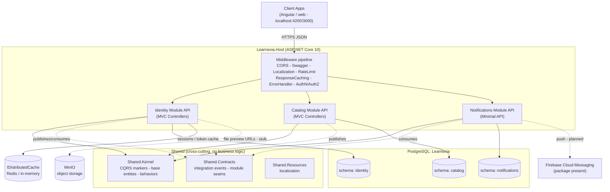

**Request flow:** client → Host middleware pipeline → module controller/endpoint → `Mediator.Send` → `ValidationBehavior` → command/query handler → domain service or repository → `DbContext` → PostgreSQL. Modules are wired in [Program.cs](../backend/src/Host/Learnexia.Host/Program.cs) via `AddIdentityModule` / `AddCatalogModule` / `AddNotificationsModule`, and controllers are discovered as MVC *application parts* per module.

> **(assumption)** The "Client Apps" node is inferred from the CORS allow-list (`localhost:4200`, `3000`, …) in [appsettings.json](../backend/src/Host/Learnexia.Host/appsettings.json); no frontend exists in this repo.
> **(stub)** MinIO/file-preview and Firebase push are referenced (packages + `IFilePreviewUrlProvider`) but the Identity implementation is a `NoOp` stub; see §4.

---

## 2. Low-Level Architecture

Every module follows the same four-layer Clean/Onion structure: **Api → Application → Infrastructure → Domain**, with `Application` and `Domain` having no outward dependencies. The diagram below shows the layering and the central CQRS request pipeline shared by all modules.

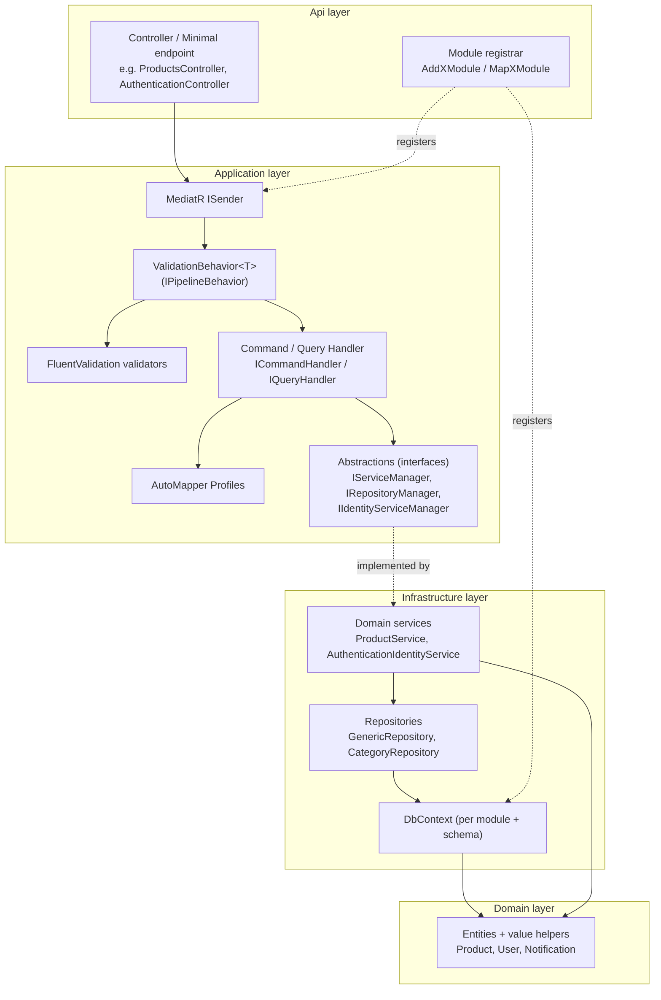

The persistence base hierarchy in `Shared.Kernel` is what makes audit-stamping uniform across modules. Catalog entities derive from `FullAuditedEntity`; the Notifications module uses a separate DDD-flavored base (`Entity<TId>` / `AuditableEntity<TId>` with domain-event support).

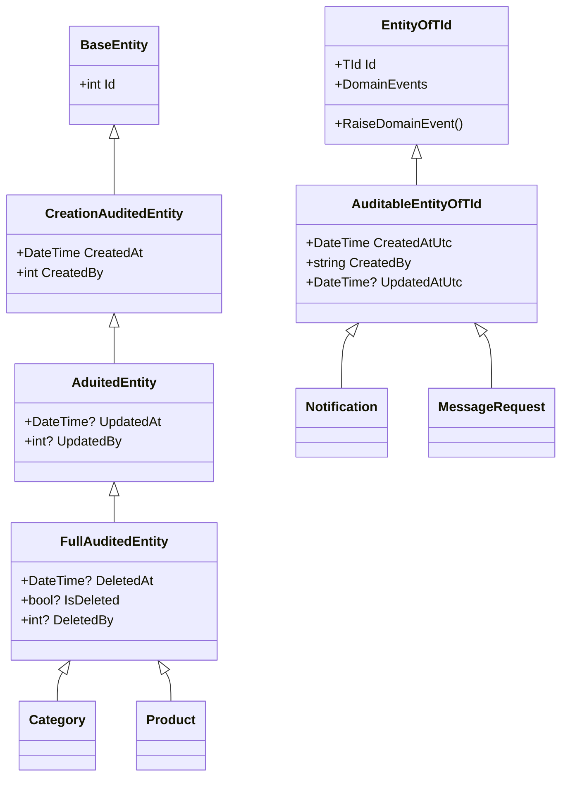

Catalog's infrastructure uses a **Repository Manager / Service Manager** aggregation (`IRepositoryManager` → `GenericRepository`, `IServiceManager` → `ProductService : BaseService`), while Identity aggregates its services behind `IIdentityServiceManager` (Authentication, Authorization, UserManagement, Session). Sources: [GenericRepository.cs](../backend/src/Modules/Catalog/Learnexia.Modules.Catalog.Infrastructure/Repository/GenericRepository.cs), [IIdentityServiceManager.cs](../backend/src/Modules/Identity/Learnexia.Modules.Identity.Application/Abstractions/IIdentityServiceManager.cs), [Shared.Kernel/Entities](../backend/src/Shared/Learnexia.Shared.Kernel/Entities/).

> Mermaid note: `Entity<TId>` and `AuditableEntity<TId>` are rendered as `EntityOfTId` / `AuditableEntityOfTId` because angle-bracket generics are not valid `classDiagram` identifiers.

---

## 3. Components

| Component | Responsibility | Tech | Key files / paths |
|---|---|---|---|
| **Learnexia.Host** | Composition root: builds the pipeline, registers modules, maps controllers + minimal endpoints, runs Identity seeding. | ASP.NET Core 10 | [src/Host/Learnexia.Host/Program.cs](../backend/src/Host/Learnexia.Host/Program.cs), [Extensions/ServiceExtensions.cs](../backend/src/Host/Learnexia.Host/Extensions/ServiceExtensions.cs) |
| **Host middleware** | Error handling, authorization logging, rate limiting, response caching, localization. | ASP.NET Core | [Middleware/ErrorHandlerMiddleWare.cs](../backend/src/Host/Learnexia.Host/Middleware/ErrorHandlerMiddleWare.cs), [Middleware/AuthorizationLoggingMiddleware.cs](../backend/src/Host/Learnexia.Host/Middleware/AuthorizationLoggingMiddleware.cs) |
| **Identity module** | Users, roles, JWT auth, refresh tokens, sessions, permissions, profile, password flows. | Identity, JWT, MediatR, EF | [src/Modules/Identity/](../backend/src/Modules/Identity/) |
| **Catalog module** | Products & categories CRUD (reference/demo domain). | MediatR, EF, repository pattern | [src/Modules/Catalog/](../backend/src/Modules/Catalog/) |
| **Notifications module** | Accept notification send requests; consume integration events. | Minimal API, MediatR, EF | [src/Modules/Notifications/](../backend/src/Modules/Notifications/) |
| **Shared.Kernel** | CQRS marker interfaces, base/audited entities, `ValidationBehavior`, `ICurrentUserService`, `IGenericRepository`, domain-event abstractions, results/pagination. | .NET lib | [src/Shared/Learnexia.Shared.Kernel/](../backend/src/Shared/Learnexia.Shared.Kernel/) |
| **Shared.Contracts** | Inter-module seams: `IIntegrationEvent`, `UserRegisteredIntegrationEvent`, `ProductPublishedIntegrationEvent`, `IUserLookup`, `IUserNotificationService`, `IFilePreviewUrlProvider`. | .NET lib | [src/Shared/Learnexia.Shared.Contracts/](../backend/src/Shared/Learnexia.Shared.Contracts/) |
| **Shared.Resources** | Localization resources (ar/en). | .NET lib | [src/Shared/Learnexia.Shared.Resources/](../backend/src/Shared/Learnexia.Shared.Resources/) |
| **PostgreSQL** | Single DB (`Learnexia`), schema-per-module (`identity`, `catalog`, `notifications`). | PostgreSQL (Npgsql EF provider) | [appsettings.json](../backend/src/Host/Learnexia.Host/appsettings.json), module `DependencyInjection.cs` |
| **Redis / IDistributedCache** | Session store + token cache. | Redis | [SessionManagementService.cs](../backend/src/Modules/Identity/Learnexia.Modules.Identity.Infrastructure/Services/Sessions/SessionManagementService.cs) |
| **MinIO** | Object storage for files (preview-URL seam). | MinIO | [IFilePreviewUrlProvider.cs](../backend/src/Shared/Learnexia.Shared.Contracts/Storage/IFilePreviewUrlProvider.cs) |

---

## 4. Services (modules, endpoints, dependencies)

### 4.1 Identity Module
**Purpose:** authentication, JWT lifecycle, user & role management, permissions, sessions, user profile. Controllers are thin and delegate to MediatR handlers; handlers call services aggregated by `IIdentityServiceManager`. Source: [IdentityModule.cs](../backend/src/Modules/Identity/Learnexia.Modules.Identity.Api/IdentityModule.cs).

| Method | Route | Action |
|---|---|---|
| POST | `/api/Users/Authentication/Sign-In` | Issue JWT + refresh token *(AllowAnonymous)* |
| POST | `/api/Users/Authentication/Validate-Token` | Validate access token *(AllowAnonymous)* |
| POST | `/api/Users/Authentication/Refresh-Token` | Exchange refresh token *(AllowAnonymous)* |
| POST | `/api/Users/Authentication/Sign-Out` | Terminate session *(Authorize)* |
| GET | `/api/Users/Authorzation/RoleList` | List roles |
| GET | `/api/Users/Authorzation?id=` | Get role by id |
| GET | `/api/Users/Authorzation/CalimList` | List available claims/permissions |
| POST | `/api/Users/Authorzation/Create` | Create role + claims |
| PUT | `/api/Users/Authorzation/Update` | Edit role + claims |
| DELETE | `/api/Users/Authorzation?id=` | Delete role |
| GET/POST/PUT/DELETE | `/api/Users/UserManagement/{Action}` | User CRUD, roles, password (change/set/admin-reset), profile, language, role-availability, resend-registration |

**Depends on:** ASP.NET Core Identity (`User`/`Role`, int keys), JWT bearer, `IdentityModuleDbContext` (schema `identity`, PostgreSQL), `IDistributedCache` (sessions), AutoMapper, FluentValidation; cross-module seams `IUserNotificationService` and `IFilePreviewUrlProvider` resolve to **`NoOp` stubs** ([NoOpUserNotificationService.cs](../backend/src/Modules/Identity/Learnexia.Modules.Identity.Infrastructure/Services/Stubs/NoOpUserNotificationService.cs)). Roles are seeded idempotently at startup ([IdentitySeeder.cs](../backend/src/Modules/Identity/Learnexia.Modules.Identity.Infrastructure/Persistence/Seed/IdentitySeeder.cs)).

### 4.2 Catalog Module
**Purpose:** CRUD for products and categories — currently a reference/demo domain demonstrating the module template (repository + service manager). Source: [CatalogModule.cs](../backend/src/Modules/Catalog/Learnexia.Modules.Catalog.Api/CatalogModule.cs).

| Method | Route | Action |
|---|---|---|
| GET | `/api/Catalog/Categories/List` | Paged categories |
| GET | `/api/Catalog/Categories?id=` | Category by id |
| POST | `/api/Catalog/Categories/Create` | Add category |
| GET | `/api/Catalog/Products/List` | Paged products |
| GET | `/api/Catalog/Products?id=` | Product by id |
| POST | `/api/Catalog/Products/Create` | Add product |
| PUT | `/api/Catalog/Products/Update` | Edit product |
| DELETE | `/api/Catalog/Products?id=` | Delete product |

**Depends on:** `CatalogDbContext` (schema `catalog`, PostgreSQL), `IRepositoryManager`/`IServiceManager`, `ICurrentUserService` (audit stamping in `SaveChangesAsync(userId)`), MediatR, AutoMapper, FluentValidation.

### 4.3 Notifications Module
**Purpose:** accept notification-send requests and (by design) react to events from other modules. Exposed via **Minimal API**, not MVC. Source: [NotificationsModule.cs](../backend/src/Modules/Notifications/Learnexia.Modules.Notifications.Api/NotificationsModule.cs).

| Method | Route | Action |
|---|---|---|
| POST | `/api/notifications` | Send notification → `SendNotificationCommand`; returns `202 Accepted` |

**Depends on:** `NotificationsDbContext` (schema `notifications`, PostgreSQL, exposed via `INotificationsDbContext`), MediatR, FluentValidation. Subscribes to `UserRegisteredIntegrationEvent` via `UserRegisteredIntegrationEventHandler` — **(stub)** the handler currently `throw new NotImplementedException()` ([UserRegisteredIntegrationEventHandler.cs](../backend/src/Modules/Notifications/Learnexia.Modules.Notifications.Application/IntegrationEventHandlers/UserRegisteredIntegrationEventHandler.cs)).

### 4.4 Inter-module communication
Modules are decoupled through `Shared.Contracts`. Integration events implement `IIntegrationEvent : INotification` (MediatR), so a publishing module never references a consuming module — it raises a contract event, and MediatR dispatches it in-process. Synchronous cross-module needs use interface seams (`IUserLookup`, `IUserNotificationService`, `IFilePreviewUrlProvider`) implemented on the providing side.

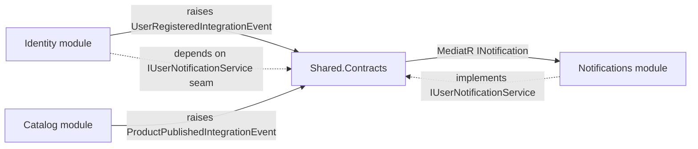

> **(assumption / stub)** The event *contracts* and the subscriber exist, but the wiring is incomplete: the `UserRegisteredIntegrationEvent` handler is unimplemented and Identity resolves `IUserNotificationService` to a `NoOp`. So inter-module messaging is **scaffolded, not yet functional**.

---

## 5. Data Model / ERD

There is no single relational model — each module owns an isolated schema in the same database, and **cross-module foreign keys are deliberately not modeled** (e.g., `CreatedBy` is a plain `int`, not a FK to `identity.AspNetUsers`; see the note in [CreationAuditedEntity.cs](../backend/src/Shared/Learnexia.Shared.Kernel/Entities/CreationAuditedEntity.cs)). The diagrams below are therefore split by schema.

### 5.1 `identity` schema
ASP.NET Core Identity tables (int keys) plus refresh tokens and audit history. Table names from [InitialIdentity migration](../backend/src/Modules/Identity/Learnexia.Modules.Identity.Infrastructure/Migrations/20260520073906_InitialIdentity.cs).

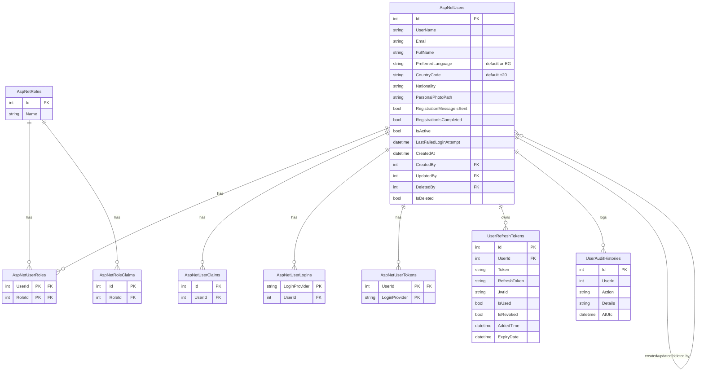

> **(assumption)** `UserSession` is **not** an EF table — it is a model serialized into `IDistributedCache` by `SessionManagementService`, so it is excluded from the ERD. Sources: [UserSession.cs](../backend/src/Modules/Identity/Learnexia.Modules.Identity.Domain/Entities/UserSession.cs), [SessionManagementService.cs](../backend/src/Modules/Identity/Learnexia.Modules.Identity.Infrastructure/Services/Sessions/SessionManagementService.cs).

### 5.2 `catalog` schema
Source: [Product.cs](../backend/src/Modules/Catalog/Learnexia.Modules.Catalog.Domain/Entities/Product.cs), [Category.cs](../backend/src/Modules/Catalog/Learnexia.Modules.Catalog.Domain/Entities/Category.cs).

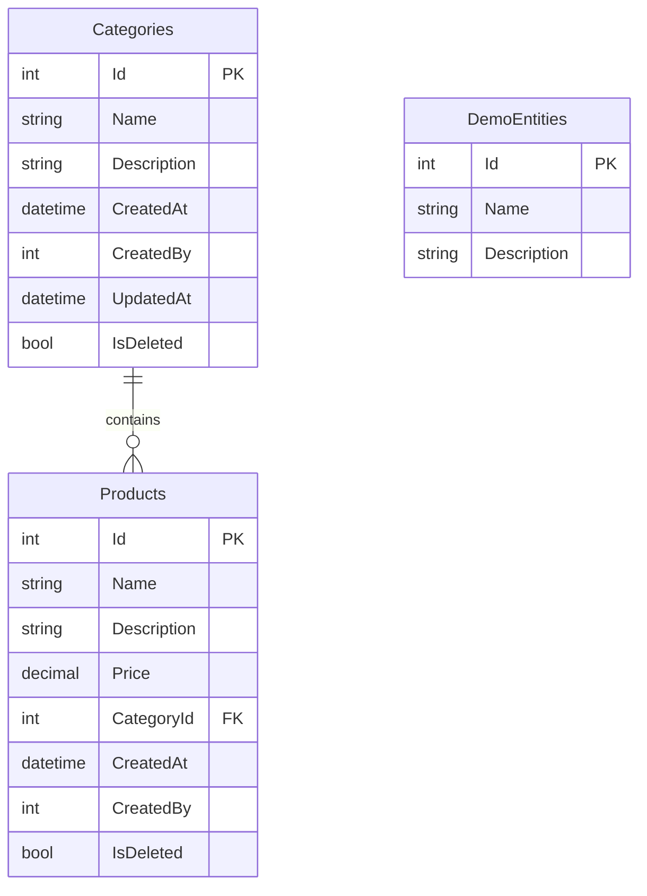

### 5.3 `notifications` schema
Source: [Notification.cs](../backend/src/Modules/Notifications/Learnexia.Modules.Notifications.Domain/Entities/Notification.cs) and sibling entities.

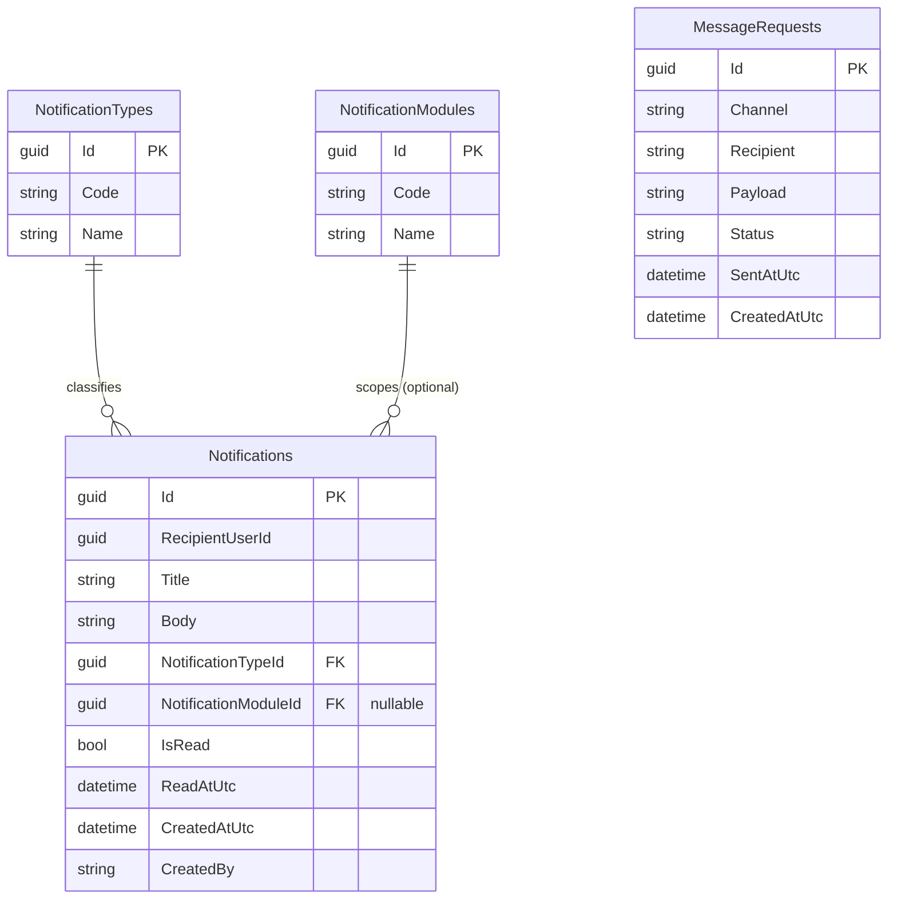

---

## 6. API Conventions & Response Envelope

All controller actions return a uniform envelope, `BaseResponse<T>` (built by the `BaseResponseHandler` helper that handlers inherit). Paged endpoints return `PaginatedResult<T>`, which extends `BaseResponse<List<T>>` with paging metadata. Source: [BaseResponse.cs](../backend/src/Shared/Learnexia.Shared.Kernel/Responses/BaseResponse.cs), [PaginatedResult.cs](../backend/src/Shared/Learnexia.Shared.Kernel/Responses/PaginatedResult.cs).

```jsonc
// BaseResponse<T>
{
  "statusCode": 200,        // HttpStatusCode enum (200, 201, 400, 404, 401, 424, 500)
  "successed": true,        // NOTE: spelled "Successed" in source
  "message": "Successfully.",
  "data": { },
  "errors": []
}

// PaginatedResult<T> adds:
{
  "currentPage": 1, "totalCount": 42, "totalPages": 5, "pageSize": 10,
  "data": [ ]
}
```

- **Validation failures** are shaped separately as **HTTP 422** with a `BaseResponse` body, via `ValidationErrorResponseFactory` wired into `ApiBehaviorOptions` ([Program.cs](../backend/src/Host/Learnexia.Host/Program.cs), [ValidationErrorResponseFactory.cs](../backend/src/Host/Learnexia.Host/Extensions/ValidationErrorResponseFactory.cs)).
- **Status mapping** (from `BaseResponseHandler`): `Success`→200, `Created`→201, `BadRequest`→400, `Unauthorized`→401, `NotFound`→404, `BusinessValidation`→424 (`FailedDependency`), `ServerError`→500.
- **API versioning** is `v2` (Swagger endpoint `/swagger/v2/swagger.json`); content negotiation supports JSON + XML; `X-Pagination` is exposed via CORS.

---

## 7. Key Runtime Flows

### 7.1 CQRS request pipeline (generic)
Every request through any module follows the same path. The `ValidationBehavior` runs only for `ICommand<>` requests; queries skip it.

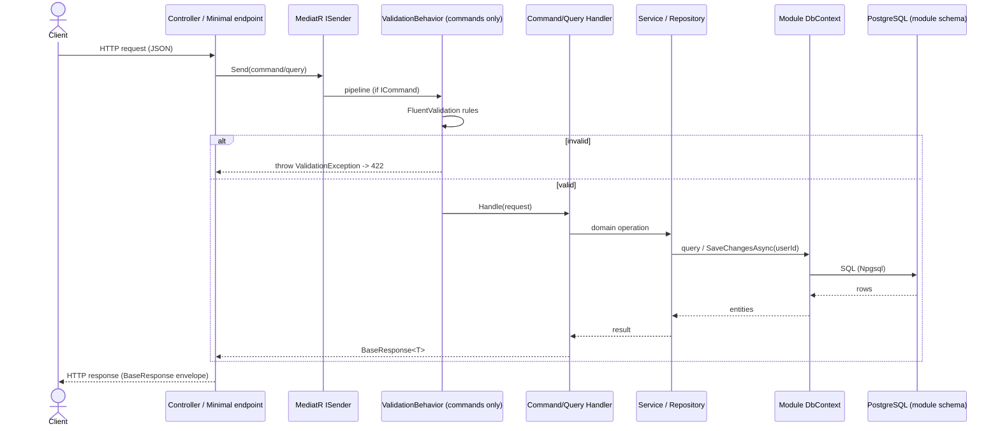

### 7.2 Sign-in & session creation
Grounded in [SignInCommandHandler.cs](../backend/src/Modules/Identity/Learnexia.Modules.Identity.Application/Features/Authentications/Commands/SignIn/SignInCommandHandler.cs). The JWT carries a `Jti` and a `SessionId` claim; the session itself is stored in `IDistributedCache`, not the database.

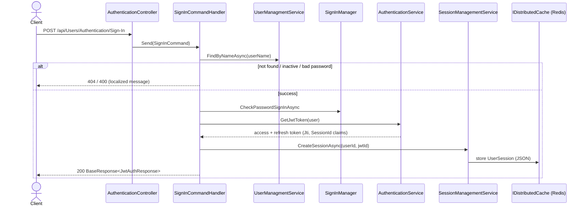

> Account protection: ASP.NET Identity lockout is configured at **5 failed attempts / 5-minute lockout**; tokens default to **30-min access / 7-day refresh**. Sources: [Identity DependencyInjection.cs](../backend/src/Modules/Identity/Learnexia.Modules.Identity.Infrastructure/DependencyInjection.cs), [appsettings.json](../backend/src/Host/Learnexia.Host/appsettings.json).

---

## 8. Middleware Pipeline

Registration order in [Program.cs](../backend/src/Host/Learnexia.Host/Program.cs) (after `app.Build()`). Order matters: the error handler wraps everything downstream, and authentication precedes authorization.

```mermaid
graph LR
    REQ[Request] --> CORS["UseCors"]
    CORS --> SWAG["Swagger / SwaggerUI"]
    SWAG --> LOC["RequestLocalization"]
    LOC --> HSTS["HSTS + StaticFiles"]
    HSTS --> FWD["ForwardedHeaders"]
    FWD --> ERR["ErrorHandlerMiddleWare"]
    ERR --> AUTHLOG["AuthorizationLoggingMiddleware"]
    AUTHLOG --> RATE["IpRateLimiting (200/min)"]
    RATE --> CACHE["ResponseCaching"]
    CACHE --> AUTHN["Authentication (JWT)"]
    AUTHN --> AUTHZ["Authorization (policies)"]
    AUTHZ --> MAP["MapControllers + module endpoints"]
    MAP --> RES[Response]
```

---

## 9. Authorization Model (RBAC + permissions)

Authorization is **claim/permission-based on top of roles**. At startup the Host registers one authorization **policy per permission**, each requiring a `Permission` claim of that name. Permissions are generated per module as `{Module}.{Action}` for actions `View, List, Create, Edit, Delete`. Currently `Claims.GenerateModules()` returns only **`Catalog`** (so policies `Catalog.View … Catalog.Delete` exist). Roles come from the `Roles` enum (e.g. `SuperAdmin`, `Admin`, `FundManager`, `LegalCouncil`, `BoardSecretary`, …). Sources: [Claims.cs](../backend/src/Modules/Identity/Learnexia.Modules.Identity.Domain/Constants/Claims.cs), [CustomClaimTypes.cs](../backend/src/Modules/Identity/Learnexia.Modules.Identity.Domain/Constants/CustomClaimTypes.cs), [Identity DependencyInjection.cs](../backend/src/Modules/Identity/Learnexia.Modules.Identity.Infrastructure/DependencyInjection.cs).

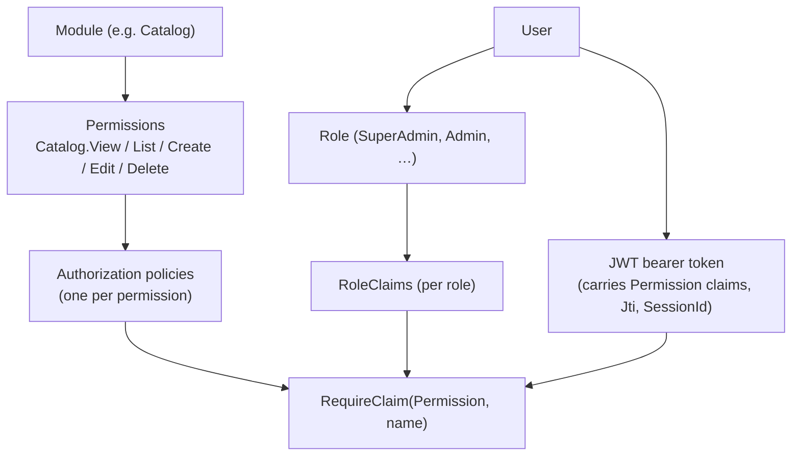

> **(observation)** Most module controllers currently carry no `[Authorize(policy)]` attributes (e.g. Catalog controllers are unattributed), so the permission policies exist but are not yet enforced at most endpoints. Only Identity's `Sign-Out` is `[Authorize]`; sign-in/validate/refresh are `[AllowAnonymous]`.

---

## 10. Deployment / Runtime Topology

The Docker composition runs the API alongside a database, Redis, and MinIO on one bridge network. Source: [docker-compose.yaml](../docker/docker-compose.yaml), [Dockerfile](../docker/Dockerfile).

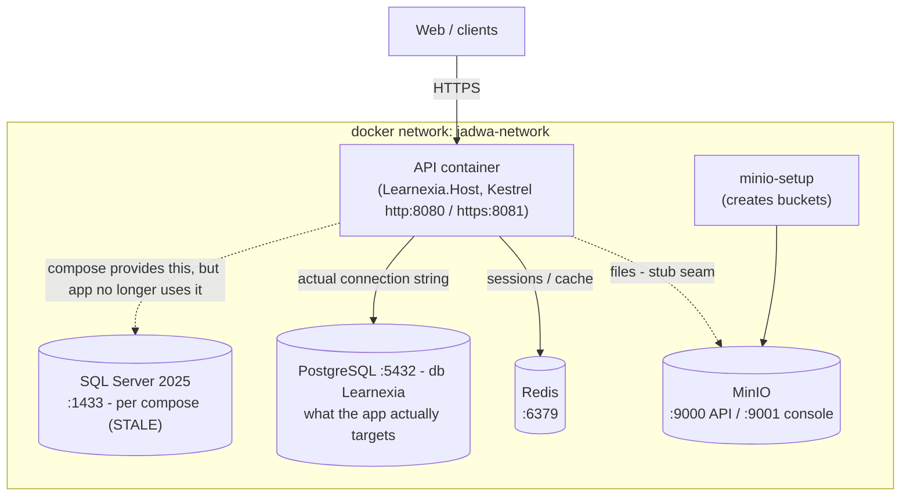

> **(mismatch — action needed)** The application code and `appsettings.json` target **PostgreSQL** (`Host=localhost;Port=5432;Database=Learnexia`), but [docker-compose.yaml](../docker/docker-compose.yaml) still provisions a **SQL Server 2025** container (`sqlserver`, port 1433) — it has **not** been updated for the PostgreSQL migration, so `docker compose up` does not provide the database the app expects. The compose service is also still named `jadwa-api` with an `aspnetapp.pfx` and MinIO env vars carried over from the `backend/` project. **To run via Docker, replace the `sqlserver` service with a `postgres` service** (and point the connection string at it). Override/staging/production compose files under [docker/](../docker/) were not deeply analyzed.

---

## 11. CQRS Pattern Implementation

CQRS is implemented with **MediatR**. `Shared.Kernel.Messaging` defines thin marker interfaces over MediatR's `IRequest`/`IRequestHandler`; commands and queries are the same mechanically but separate the write/read intent. Each module registers its own handlers, validators, and the validation pipeline by assembly scan (see §13). Cross-references: request flow §7.1, validation envelope §6. Sources: [Shared.Kernel/Messaging](../backend/src/Shared/Learnexia.Shared.Kernel/Messaging/), [ValidationBehavior.cs](../backend/src/Shared/Learnexia.Shared.Kernel/Behaviors/ValidationBehavior.cs).

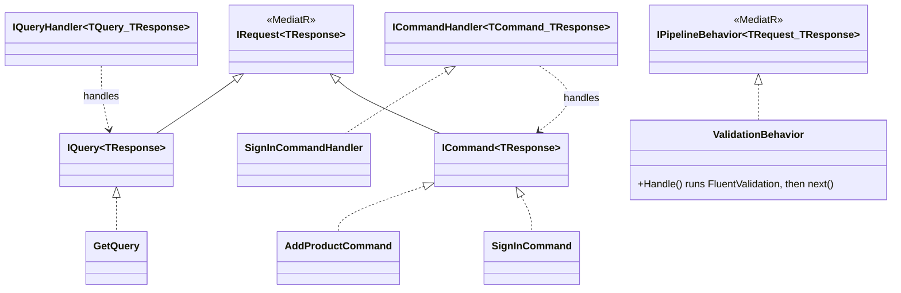

- **Commands**: `SignInCommand`, `AddUserCommand`, `AddProductCommand`, `AddRoleCommand`, `SendNotificationCommand`, … (write side; run through `ValidationBehavior`).
- **Queries**: `GetQuery`, `ListQuery`, `GetUserProfileQuery`, `GetRoleListQuery`, … (read side; skip validation).
- **Pipeline**: only `ValidationBehavior<TRequest,TResponse>` is registered, and only for `ICommand<>` (its generic constraint excludes queries). Identity and Catalog register it; **Notifications does not** ([Notifications DependencyInjection.cs](../backend/src/Modules/Notifications/Learnexia.Modules.Notifications.Application/DependencyInjection.cs)).
- Many handlers also inherit `BaseResponseHandler` to build the `BaseResponse<T>` envelope (§6).

---

## 12. Repository Pattern & Unit of Work

The **Catalog** module uses a repository + manager layering; **Identity** instead works through ASP.NET Identity's `UserManager`/`SignInManager`/`RoleManager` aggregated under `IIdentityServiceManager`; **Notifications** uses the `DbContext` directly via `INotificationsDbContext`. Sources: [GenericRepository.cs](../backend/src/Modules/Catalog/Learnexia.Modules.Catalog.Infrastructure/Repository/GenericRepository.cs), [RepositoryManager.cs](../backend/src/Modules/Catalog/Learnexia.Modules.Catalog.Infrastructure/Repository/RepositoryManager.cs), [ServiceManager.cs](../backend/src/Modules/Catalog/Learnexia.Modules.Catalog.Infrastructure/Service/ServiceManager.cs).

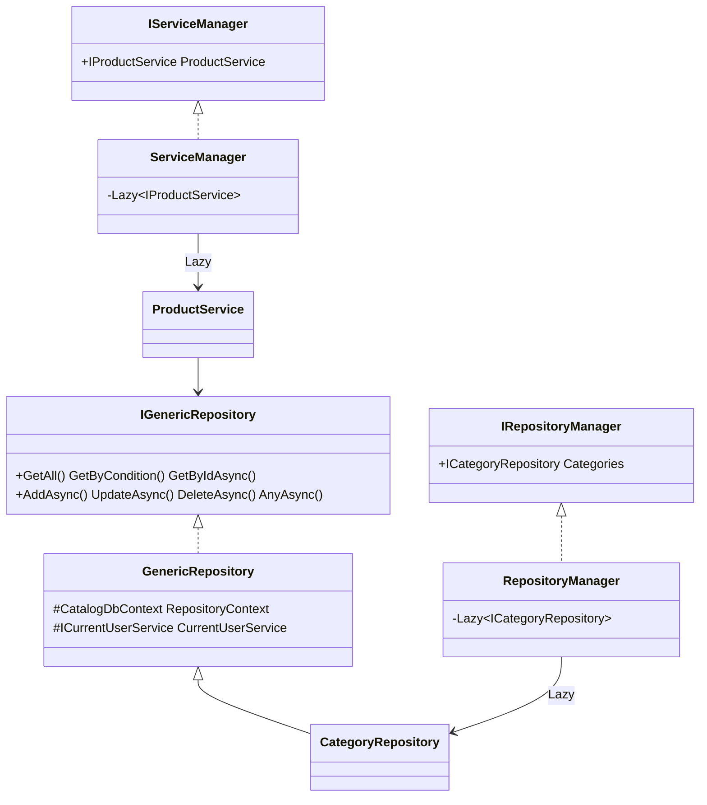

> **(important correction)** Despite the "Unit of Work" framing in the reference doc, **`backend` has no Unit of Work / `Complete()` / `SaveAsync()` aggregator.** Every `GenericRepository` write method (`AddAsync`, `UpdateAsync`, `DeleteAsync`, and the range variants) calls `RepositoryContext.SaveChangesAsync(userId)` **immediately**, so the commit boundary is **per repository operation**, not a batched transaction. The scoped `DbContext` is the only "unit of work" EF provides implicitly. `RepositoryManager`/`ServiceManager` are **Lazy aggregators** of sub-repositories/services, not transaction coordinators. `SaveChangesAsync(int userId)` is overridden on `CatalogDbContext` to stamp audit fields (§2).

---

## 13. Service Registration & Dependency Injection

Composition is layered: the **Host** calls one `AddXModule(configuration)` per module; each module's `AddXModule` calls its `AddXApplication()` + `AddXInfrastructure()` and registers its controllers as an MVC application part. Host-level cross-cutting services are configured by extension methods in `ServiceExtensions`. Sources: [Program.cs](../backend/src/Host/Learnexia.Host/Program.cs), [ServiceExtensions.cs](../backend/src/Host/Learnexia.Host/Extensions/ServiceExtensions.cs), each module's `DependencyInjection.cs` / `*Module.cs`.

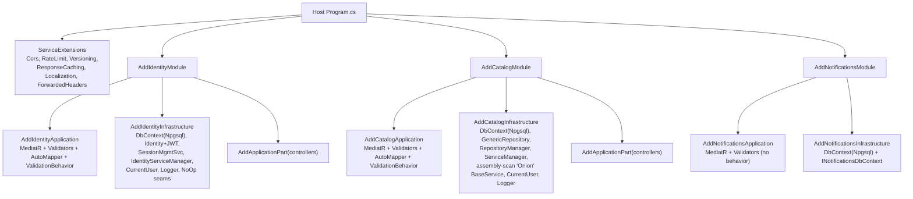

**Lifetimes & notable registrations:**
- `DbContext` per module → **Scoped** (`AddDbContext`, **Npgsql/PostgreSQL** provider, per-schema migrations history table).
- Repositories, services (`IGenericRepository`, `IRepositoryManager`, `IServiceManager`, `IIdentityServiceManager`, `ISessionManagementService`), and `ICurrentUserService` → **Scoped**.
- `ValidationBehavior<,>` → **Transient** (`IPipelineBehavior<,>`); MediatR/AutoMapper/validators registered by assembly scan.
- `JwtSettings`, `SessionSettings` → **Singleton** (bound from configuration).
- **(inconsistency)** `ILoggerManager` is registered **both** as Singleton (`AddLoggerServices`) **and** Scoped in the same module — last registration wins (Scoped); see §15.
- **(assembly scan)** Catalog infra reflects over types whose full name contains `"Onion"` and derive from `BaseService<>` to auto-bind their interfaces — currently matches nothing by that name, so it is effectively a no-op convention hook.

---

## 14. Security Architecture

A consolidated view of the security controls already described piecemeal (auth §7.2, authz §9, middleware §8). Sources: [Identity DependencyInjection.cs](../backend/src/Modules/Identity/Learnexia.Modules.Identity.Infrastructure/DependencyInjection.cs), [ServiceExtensions.cs](../backend/src/Host/Learnexia.Host/Extensions/ServiceExtensions.cs), [appsettings.json](../backend/src/Host/Learnexia.Host/appsettings.json).

| Control | Implementation | Notes |
|---|---|---|
| **Authentication** | JWT bearer; `TokenValidationParameters` validates issuer, audience, lifetime, signing key (HMAC-SHA, `SymmetricSecurityKey` from `JwtSettings.Secret`) | `RequireHttpsMetadata = false` (dev-friendly) — **(flag)** tighten for prod |
| **Token policy** | 30-min access token, 7-day refresh; refresh tokens persisted in `identity.UserRefreshTokens` | §5.1, §7.2 |
| **Sessions** | `UserSession` in `IDistributedCache` (Redis); `SessionId` + `Jti` claims in the JWT | §7.2 |
| **Password policy** | RequireDigit/Lowercase/Uppercase/NonAlphanumeric, min length 6, unique email | ASP.NET Identity options |
| **Lockout** | 5 failed attempts → 5-min lockout, enabled for new users | |
| **Authorization** | Permission-claim policies (`{Module}.{Action}`), role + RoleClaims | §9 — **(flag)** not enforced on most endpoints |
| **CORS** | Named `CorsPolicy`, explicit origins, `AllowCredentials`, exposes `X-Pagination`, preflight 10-min | origins from `AllowedOrigins` |
| **Rate limiting** | IP-based, 200 requests / 1 minute, all endpoints (`*`) | in-memory counter store |
| **Transport** | HSTS, `ForwardedHeaders = All` (reverse-proxy aware) | |
| **Secrets** | `JwtSettings.Secret` lives in `appsettings.json` with a `CHANGE_ME…` default | **(flag)** move to a secret manager / env var before production |

---

## 15. Monitoring & Logging

Logging is **NLog**, accessed through the `ILoggerManager` abstraction (`LoggerManager` wraps `LogManager.GetCurrentClassLogger()`); the Host adds an `AuthorizationLoggingMiddleware` that logs policy requirements per request, and `ErrorHandlerMiddleWare` centralizes exception handling. Sources: [LoggerManager.cs](../backend/src/Shared/Learnexia.Shared.Kernel/Logging/LoggerManager.cs), [AuthorizationLoggingMiddleware.cs](../backend/src/Host/Learnexia.Host/Middleware/AuthorizationLoggingMiddleware.cs), [Directory.Packages.props](../backend/Directory.Packages.props).

- **Application logging:** inject `ILoggerManager` (`LogInfo/Warn/Debug/Error`). Microsoft.Extensions.Logging levels are configured in `appsettings.json` (Debug in Development, Information/Warning in base).
- **(gap)** **No `nlog.config` file exists** in the repo — NLog has no configured targets, so structured/file/console NLog output is effectively unconfigured until one is added.
- **(gap)** **OpenTelemetry is referenced but not wired** — the OTel exporter/instrumentation packages appear in `Directory.Packages.props`, but there is **no `AddOpenTelemetry(...)` call** anywhere in `src`, and no metrics/tracing pipeline. Treated as planned.
- **(gap)** No health-check endpoints (`/health`), no metrics endpoint, and no hosted/background monitoring services were found.
- Request/error visibility today comes from the two middleware components plus ASP.NET Core's default logging.

---

## 16. Relationship to the Learnexia Product Spec

The product/requirements docs ([BRD.md](BRD.md), [SRS.md](SRS.md), [BUSINESS_PLAN.md](BUSINESS_PLAN.md), [TASK_BREAKDOWN.md](TASK_BREAKDOWN.md)) describe the *target* Learnexia platform synthesized from [info/](../info/). This section reconciles that target against what `backend` actually contains today.

| Domain area (target) | Status in current backend | Notes |
|---|---|---|
| Identity (users, roles, JWT, sessions) | **Exists** — `identity` schema (PostgreSQL) | Reuse; **extend** `User` with grade/age/language/country + Parent linkage |
| Catalog (Product/Category) | **Exists** — `catalog` schema (PostgreSQL) | **Demo scaffolding** — to be replaced by the `learning` module |
| Notifications | **Exists** — `notifications` schema | Reuse for parent-report delivery |
| Learning (Subject/Unit/Lesson/Concept/Skill, skill trees) | **New** | Proposed in [SRS §6](SRS.md) |
| Assessment (QuizQuestion/Attempt/StudentAnswer) | **New** | — |
| Adaptivity / Student Modeling (StudentSkillMastery) | **New** | — |
| Gamification (XP/Badge/Streak/Mission/League) | **New** | Event-driven |
| Parent & Analytics (WeeklyReport) | **New** | — |
| Curriculum Intelligence (CurriculumChunk, KnowledgeNode/Edge, embeddings) | **New** | Needs **vector search** |

> **DB migration — done in code.** All three modules now run on **PostgreSQL** via `UseNpgsql` (DB `Learnexia`); the EF provider switch from SQL Server is **complete in the application**. Remaining work: add **pgvector** for RAG (new curriculum module) and **update docker-compose** to a `postgres` service (§10). Stack stays **.NET 10**; there is **no teacher role** in the target product. See [SRS §7](SRS.md).

---

## What was skipped / open items

- **Aspire / OpenTelemetry** packages are referenced but no AppHost or telemetry pipeline wiring was found in `backend/src` — treated as planned, not active.
- **`backend/tests/`** (Catalog/Identity/Notifications unit tests) were noted but not detailed here.
- **Connection string naming:** `appsettings.json` defines `"Default"` (now a **PostgreSQL** connection), while Identity/Catalog DI read `GetConnectionString("default")` and Notifications reads `"Default"`. This works (case-insensitive) but is inconsistent — flagged for awareness.
- **docker-compose is stale:** it still provisions **SQL Server**, but the app targets **PostgreSQL** — replace the `sqlserver` service with `postgres` (§10).
- Per-property column types/lengths come from entity definitions and migrations; a few Identity navigation columns (claims/logins/tokens) are summarized rather than fully expanded.
- **Deliberately excluded** (carried over from the now-removed Jadwa reference doc, and not present here): the Fund/Strategy/FundMember/Notification-job domain, the fund **State pattern** state machine, `FundNotificationJob` background service, the `.NET 8` stack, and the speculative monitoring/scaling/future-roadmap sections. `backend` targets `.NET 10` and has no hosted background services or Fund domain at this time.
- **Authorization enforcement** is incomplete: permission policies are generated (Catalog only) but most endpoints lack `[Authorize]` attributes — see §9.
- **No Unit of Work**: repository writes commit per-call via `SaveChangesAsync` — see §12.
- **Logging/monitoring gaps**: no `nlog.config`, OpenTelemetry referenced but unwired, no health checks, and a duplicate `ILoggerManager` lifetime registration — see §13 and §15.
