# Learnexia — Backend Architecture (per-module deep dive)

> **Audience:** backend engineers implementing or reviewing module features.
> **Scope:** the five modules of the `backend/` modular monolith — responsibilities, schemas, entities,
> endpoints, conventions, cross-module seams, and representative flows.
> **Read first:** [technical-architecture.md](technical-architecture.md) (cross-cutting: pipeline,
> UoW, eventing, security) and [../dev/CONVENTIONS.md](../dev/CONVENTIONS.md).
> **Sources (verified against code):** `backend/src/Modules/`, `backend/src/Shared/`,
> [../../tasks/PROGRESS.md](../../tasks/PROGRESS.md).

---

## 1. High-Level — module landscape

Five modules, each owning one PostgreSQL schema, composed by the Host. **Learning** is the reference
shape for new backend work; together with Identity, Gamification, Notifications, and Parent it carries
the domain. (The demo **Catalog** module that previously served as the reference template was
**removed on 2026-06-03** — see [../dev/HANDOFF.md](../dev/HANDOFF.md).) Solid arrows =
integration-event publish; dashed = interface-seam (sync read).


Mermaid source — diagram 1

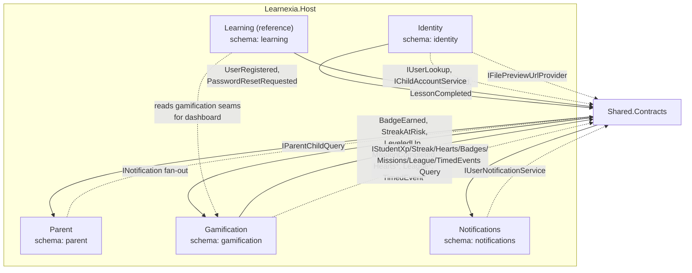

> **Isolation rule:** a module never references another module's projects. All arrows above pass
> through `Shared.Contracts`. No cross-module foreign keys.

---

## 2. Components — module-by-module

### 2.1 Identity (`identity` schema)

**Responsibility:** users, roles, JWT lifecycle, refresh tokens, sessions, permissions, profile,
avatar, OAuth, password flows, account hardening.

| Controller | Representative routes |
|---|---|
| `AuthenticationController` | sign-in, validate-token, refresh-token, sign-out |
| `AccountController` | profile read/update, avatar upload, password reset (request + set), Google OAuth |
| `UsersController` | `GET /Me` (role, language, onboarding flags), self-scoped reads |
| `UserManagementController` | user CRUD, roles, password admin-reset, language, resend-registration *(AdminOnly)* |
| `AuthorzationController` | role + claim/permission management *(AdminOnly)* |

**Key building blocks:** ASP.NET Identity (`User`/`Role`, int keys), JWT + refresh tokens,
`IDistributedCache` sessions, lockout, Turnstile CAPTCHA (`ICaptchaVerifier`), `IEmailSender`-backed
flows, MinIO avatar via `IFilePreviewUrlProvider`. **Localization (P8):** `User.LearningLanguage`
(`ar`/`en`, default `ar`, the **medium of instruction** — separate from `PreferredLanguage` and
immutable by the student); emitted as the `learning_language` JWT claim in
`AuthenticationIdentityService.GetClaims` (re-issued on refresh), set at add-child, and returned on
`/Me`. **Publishes:** `UserRegisteredIntegrationEvent`, `PasswordResetRequestedIntegrationEvent`,
`LearningLanguageChangedIntegrationEvent` (P8-04). **Provides seams:** `IUserLookup`,
`IChildAccountService` (incl. `ChangeLearningLanguageAsync`).

### 2.2 Parent (`parent` schema)

**Responsibility:** the parent↔child relationship and parent-facing family operations (add/link/list
children) layered on Identity-owned accounts.

| Controller | Representative routes |
|---|---|
| `ParentController` | add child, link existing child, list my children, **change a child's learning language** (`PUT api/Parent/Change-Learning-Language`) *(Parent/Admin roles, family-scoped)* |

**Localization (P8-04):** `ChangeChildLearningLanguage` command + validator + handler — parent-only,
family-scoped (foreign child → **403**), **confirm-gated** (missing/false `confirmFreshStart` → **424**,
enforced first). It calls Identity's `IChildAccountService.ChangeLearningLanguageAsync`; the cascade
reset is driven by the integration event (§5), not by Parent.

**Key entity:** `ParentStudent` (M:N parent↔student link). **Provides seam:** `IParentChildQuery`
(lets other modules resolve a parent's children without referencing the module). Family-scope
authorization restricts every operation to the caller's own children.

### 2.3 Learning (`learning` schema)

**Responsibility:** the curriculum hierarchy, skill graph, lessons/content, quizzes, answer capture +
feedback, and the student home dashboard.

| Controller | Purpose |
|---|---|
| `GradesController`, `SubjectsController`, `UnitsController`, `LessonsController`, `ConceptsController`, `SkillsController` | Curriculum hierarchy CRUD + browse (subjects for grade, lessons in unit, skill tree) |
| `KnowledgeGraphController` | Prerequisites / unlocked-by queries over the skill dependency graph |
| `QuizzesController` | Start attempt, submit answer (4 question types), complete/abandon |
| `StudentsController` | Per-student attempts + skill stats (granular answer history) |
| `DashboardController` | Aggregated home dashboard (subjects, streak, XP, missions via gamification seams) |

**Domain services:** `LearningPathEngine` (pure DFS unlock computation by prerequisite + mastery),
`AnswerComparator` (per-type correctness), `SkillGraphValidator` (acyclic check),
`SubjectLanguageResolver` (pure static; maps `SubjectCode` + learner language → effective
`ContentLanguage`). **Localization (P8):** `Subject.SubjectCode` (MATH/SCIENCE/ARABIC/ENGLISH) +
`Subject.Language` (`ContentLanguage` Ar/En) with a UNIQUE `(GradeId,SubjectCode,Language)` index;
`LearningSeeder` authors **6 language-tagged Subject roots per grade** (parallel ar/en trees,
per-language Math prereq graphs). `LearningLanguageClaimAccessor` (`Application/Helpers`) reads the
`learning_language` JWT claim (fallback Ar + warn, never 500); the **six read handlers**
(subjects-for-grade, skill-tree, lessons-in-unit, lesson, start-attempt, dashboard) filter/guard on the
resolved language — cross-language access → **403**. `StudentSubjectDto.SubjectCode` is exposed.
**Publishes:** `AnswerSubmittedIntegrationEvent`, `LessonCompletedIntegrationEvent`. **Consumes:**
gamification seams for the dashboard (read); `LearningLanguageChangedIntegrationEvent` via
`LearningLanguageChangedIntegrationEventHandler` → internal `ResetMathScienceProgressCommand`
(hard-deletes the student's Math/Science `Attempt` rows; `StudentAnswer` cascades).

### 2.4 Gamification (`gamification` schema)

**Responsibility:** the entire engagement loop — XP/levels, streaks (+ freeze), hearts + practice
mode, badges, daily/weekly missions, weekly leagues, timed events/challenges, and the Redis read
model.

| Controller | Purpose |
|---|---|
| `GamificationController` | XP profile / level (`/Profile`) |
| `BadgesController` | Earned + catalog badges (`/Badges/Me`) |
| `MissionsController` | Daily/weekly missions + weekly challenges (`/Missions/Me`) |
| `LeaguesController` | Current league standing (`/Leagues/Me`, anonymized) |
| `TimedEventsController` | Active timed events *(AdminOnly read)* |

**Domain services (pure):** `LevelCurve`, `StreakDayCalculator`, `LazyHeartRefiller`,
`BadgePredicateEvaluator`, `MissionPeriodCalculator`, `LeagueStandings`. **Consumes** the Learning
integration events to drive rewards; **publishes** `StudentLeveledUpIntegrationEvent`,
`BadgeEarnedIntegrationEvent`, `MissionCompletedIntegrationEvent`, `HeartsDepleted/Refilled`,
`StreakAtRisk/Broken`, `StreakFreezeConsumed`, `LeagueTierChanged`, `TimedEventStarted/Ended`,
`DailyMissionReminder`, `LapseWinBack`. **Provides seams:** `IStudentXpQuery`, `IStudentStreakQuery`,
`IStudentHeartsQuery`, `IStudentBadgesQuery`, `IStudentMissionsQuery`, `IStudentLeagueQuery`,
`IActiveTimedEventsQuery`. **Jobs:** see [technical-architecture.md](technical-architecture.md) §4.4.

### 2.5 Notifications (`notifications` schema)

**Responsibility:** in-app inbox, device tokens, preferences, transactional email, and re-engagement
nudges.

| Controller | Purpose |
|---|---|
| `NotificationsController` | Send notification (`POST /api/notifications`) |
| `InboxController` | List / mark-read in-app notifications |
| `DevicesController` | Register/remove device push tokens |
| `PreferencesController` | Notification + child re-engagement preferences |

**Key building blocks:** `IEmailSender` (`SmtpEmailSender` with CRLF-injection guard + masked logging;
`LogEmailSender` dev sink). **Consumes:** `UserRegisteredIntegrationEvent` (welcome email),
gamification re-engagement events. **Provides seam:** `IUserNotificationService`.

### 2.6 Catalog — removed (2026-06-03)

The demo **Catalog** module (Products/Categories CRUD) was the original reference template but was
**removed entirely on 2026-06-03** ([../dev/HANDOFF.md](../dev/HANDOFF.md)). New backend work now
mirrors **Learning**. Historical note: Catalog committed per repository call; all current modules use
deferred commit via `UnitOfWorkBehavior` (§3, ADR 0001).

---

## 3. Low-Level — conventions in force

| Aspect | Rule | Reference |
|---|---|---|
| Feature layout | `Features/<Aggregate>/Commands/<Verb>/` + `/Queries/<Verb>/` | CONVENTIONS §2 |
| CQRS markers | `record XCommand : ICommand<BaseResponse<T>>`; handlers inherit `BaseResponseHandler` | CONVENTIONS §3 |
| Validation | one `AbstractValidator<TCommand>`; runs for commands only | CONVENTIONS §4 |
| Responses | `BaseResponse<T>` / `PaginatedResult<T>`; `Successed` flag; `NewResult(...)` | CONVENTIONS §5 |
| Mapping | one AutoMapper `Profile` per aggregate; queries use `ProjectTo` + paginate | CONVENTIONS §6 |
| Data access | `IServiceManager` (typed services) / `IRepositoryManager` (custom repos) | CONVENTIONS §7 |
| Commit | all modules defer commit to `UnitOfWorkBehavior` (Catalog's per-call pattern left with the removed module) | ADR 0001 |
| Schema | `public const string Schema`; `HasDefaultSchema`; per-module `MigrationsHistoryTable`; `UseNpgsql` | CONVENTIONS §9 |
| Isolation | no cross-module project refs / FKs; `Shared.Contracts` only | CONVENTIONS §12 |

---

## 4. Data model (ER per schema)

Each schema is independent; cross-module references are by plain id value, never an FK.

### 4.1 `identity`


Mermaid source — diagram 2

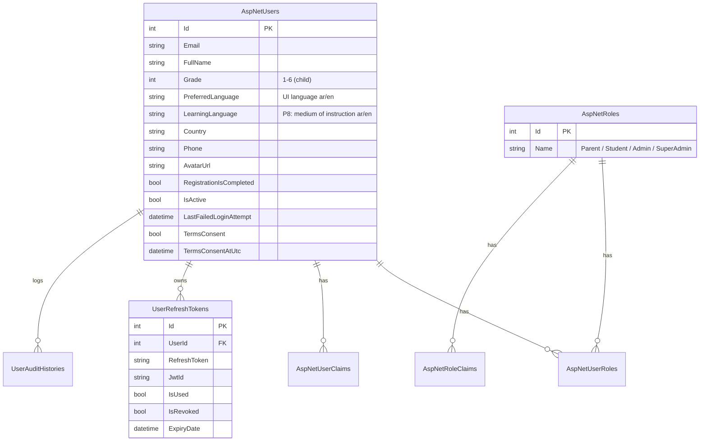

> `UserSession` is stored in Redis (`IDistributedCache`), not a table. Profile/avatar/OAuth/consent
> columns were added by the P1-12 batch.

### 4.2 `parent`


Mermaid source — diagram 3

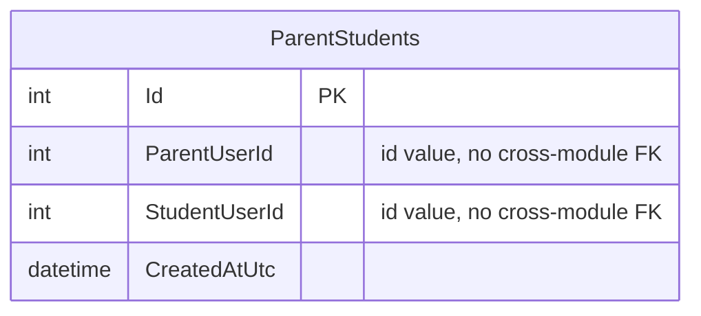

### 4.3 `learning`


Mermaid source — diagram 4

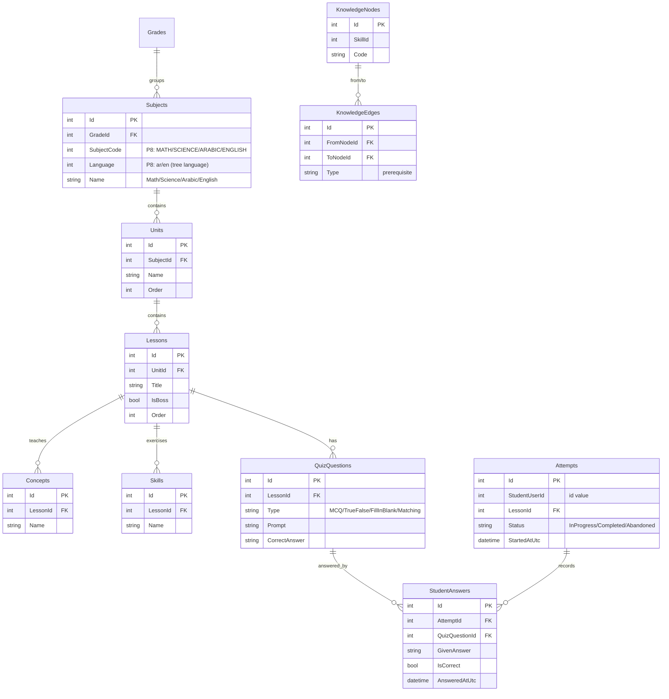

### 4.4 `gamification`


Mermaid source — diagram 5

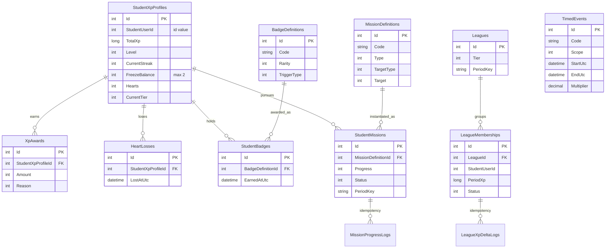

### 4.5 `notifications`


Mermaid source — diagram 6

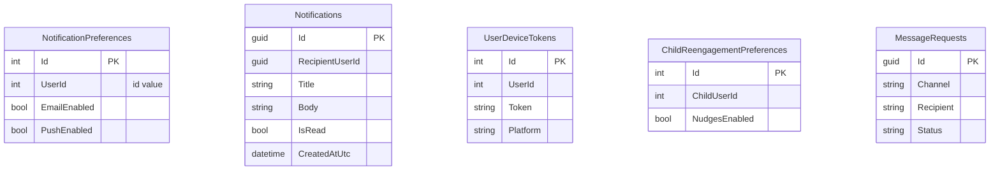

---

## 5. Cross-module integration — events & seams


Mermaid source — diagram 7

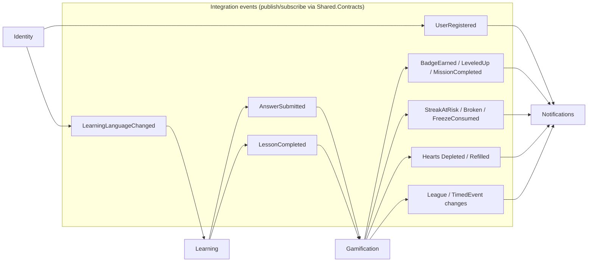

**Interface seams (synchronous reads):**

| Seam | Provided by | Consumed by | Purpose |
|---|---|---|---|
| `IUserLookup` | Identity | Notifications | resolve email/name for messages |
| `IChildAccountService` | Identity | Parent | create/update child accounts + change learning language |
| `IParentChildQuery` | Parent | others | resolve a parent's children |
| `IStudentXp/Streak/Hearts/Badges/Missions/League Query` | Gamification | Learning (dashboard) | read gamification state |
| `IActiveTimedEventsQuery` | Gamification | Learning (dashboard) | active timed events |
| `IUserNotificationService` | Notifications | Identity | send user notifications |
| `IFilePreviewUrlProvider` | (storage) | Identity | avatar preview URLs |

---

## 6. Services — representative end-to-end flows

### 6.1 Register parent → welcome email (cross-module, post-commit)

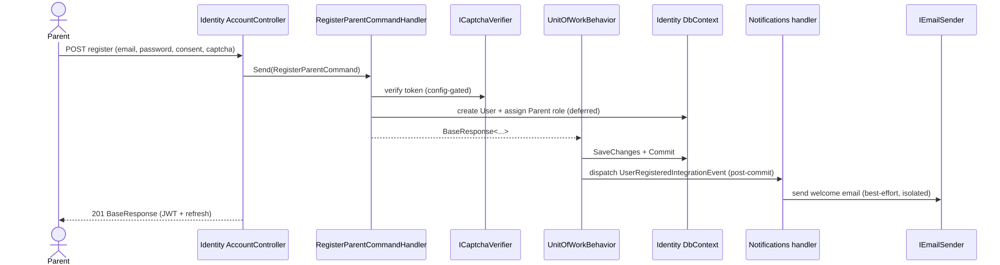

Mermaid source — diagram 8

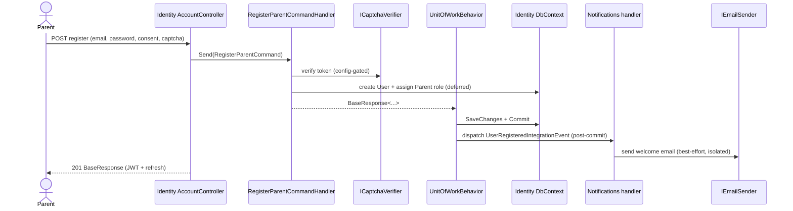

### 6.2 Submit answer → gamification fan-out

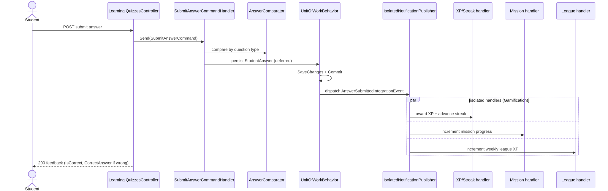

Mermaid source — diagram 9

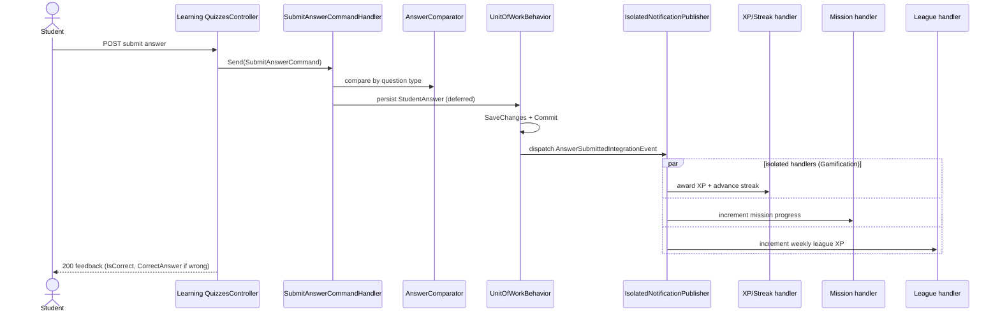

### 6.3 Weekly league rollover (Hangfire)

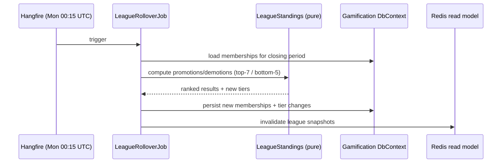

Mermaid source — diagram 10

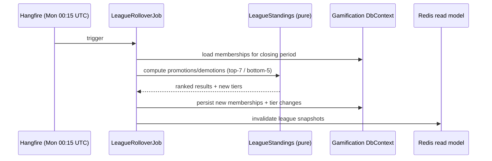

---

## 7. Known gaps / deferrals (do not replicate or assume)

| Item | Status |
|---|---|
| `RequireHttpsMetadata=false` not env-gated; forgot-password timing oracle; in-memory rate-limit store; transactional-email localization | Deferred to **P6-06** (Low severity) |
| Gamification Redis model is cache-aside snapshots, not literal `INCRBY`/Lua counters | Intentional (ADR-locked) |
| Streak freeze is earn-only (no purchase/parent-grant); freeze/timed-event reads folded into dashboard | Intentional MVP scope |
| Localization (Phase 8) — learning language, language-tagged curriculum, parent-only fresh-start | **DONE (backend)** — P8-01/02/03 (PR #90) + P8-04 (PR #91); frontend i18n remains |
| JWT placeholder secret (`CHANGE_ME`); Newtonsoft.Json CVE; integration suite needing a side Postgres | **Resolved** (hardening PR #92): `GuardJwtSecret` blocks placeholder in prod/staging (env-overridable, Dev-only warning); Newtonsoft pinned to 13.0.3 via `CentralPackageTransitivePinningEnabled`; suite self-contained |
| AI Tutor, Adaptivity, Parent Analytics, Admin Console | **(planned)** — Phases 4/5/7 |
| `architecture.md` describes 3 modules + SQL Server | **stale** — trust this doc + code |

---

## Related documents

- [technical-architecture.md](technical-architecture.md) — pipeline, UoW, eventing, security, ops
- [business-architecture.md](business-architecture.md) — capabilities, value streams
- [frontend-architecture.md](frontend-architecture.md) — planned frontend
- [../dev/CONVENTIONS.md](../dev/CONVENTIONS.md) · [../dev/CODE_TEMPLATES.md](../dev/CODE_TEMPLATES.md) · [../dev/FEATURE_PLAYBOOK.md](../dev/FEATURE_PLAYBOOK.md)
- [../../tasks/PROGRESS.md](../../tasks/PROGRESS.md) — delivery status
