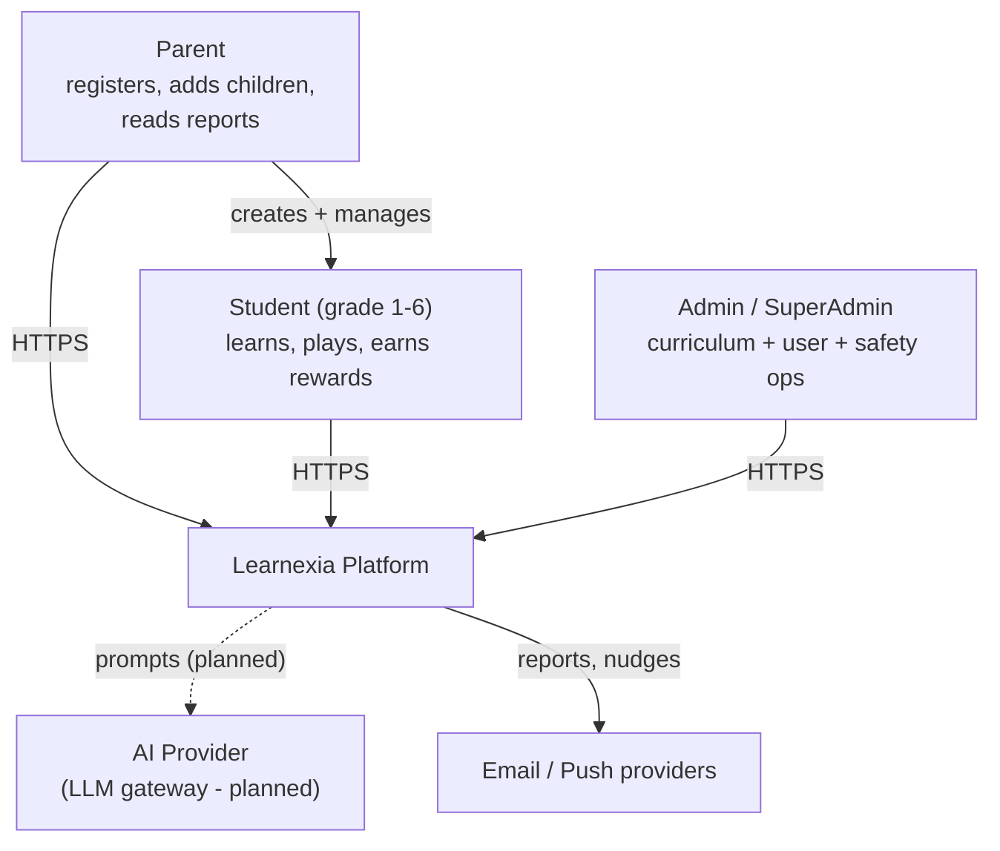
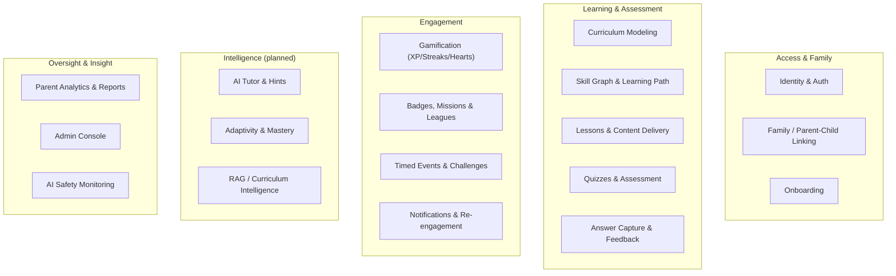
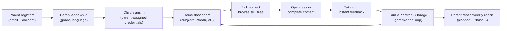
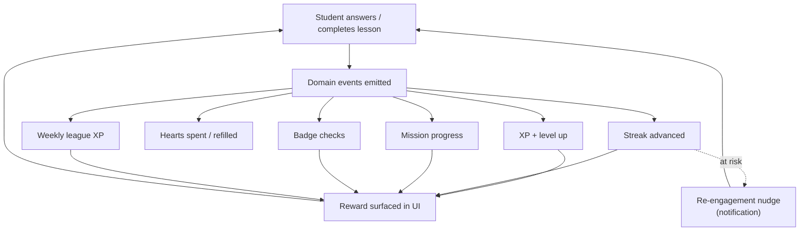
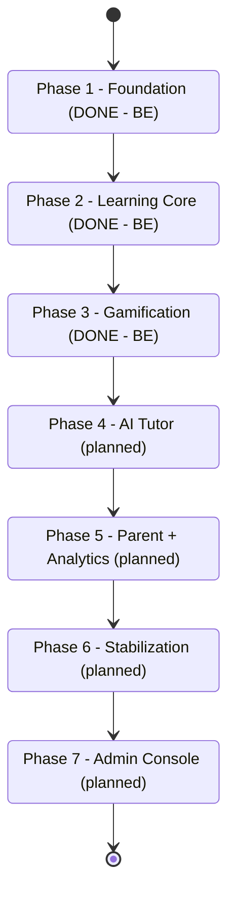

# Learnexia — Business Architecture

> **Audience:** product, business, and engineering leads who need the *why* and *what* before the *how*.
> **Scope:** the business/domain view of Learnexia. The technical realization lives in
> [technical-architecture.md](technical-architecture.md), [backend-architecture.md](backend-architecture.md),
> and [frontend-architecture.md](frontend-architecture.md).
> **Sources:** [../../CLAUDE.md](../../CLAUDE.md), [../BRD.md](../BRD.md), [../SRS.md](../SRS.md),
> [../BUSINESS_PLAN.md](../BUSINESS_PLAN.md), [../../user-stories/README.md](../../user-stories/README.md),
> [../../tasks/PROGRESS.md](../../tasks/PROGRESS.md).

---

## 1. High-Level Description (HLD)

Learnexia is an **AI-powered, gamified, adaptive learning platform for Arabic-speaking school
students** (grades 1–6). It blends an adaptive curriculum, a Duolingo-style gamification loop, and an
AI tutor, wrapped in a kid-friendly, fully **RTL (Arabic-first)** experience, with parents in the
driver's seat.

### 1.1 Product pillars

| Pillar | What it means for the business |
|---|---|
| **Adaptive learning** | Curriculum modeled as a skill graph; lessons unlock by prerequisite + mastery, difficulty adapts per student. |
| **Gamification** | XP, levels, streaks, hearts, badges, missions, weekly leagues, timed events — engagement + retention engine. |
| **AI tutor** | On-demand concept explanations, progressive hints, curriculum-grounded question generation (RAG). |
| **Parent involvement** | Parent-driven onboarding, weekly reports, weak-area detection, progress dashboards. |
| **Localization** | Arabic-first, RTL, bilingual (ar/en) content and UI. |

### 1.2 Product decisions (binding — override BRD/SRS where they conflict)

- **Parent-driven onboarding** — parents register and add children; **students never self-register**.
- **4 subjects** — Math, Science, Arabic, English. **No Social Studies.**
- **No teacher role** anywhere in the product.
- **Grade transition preserves history** — XP, badges, streaks, and mastery carry across grade changes.

### 1.3 Actors

Mermaid source — diagram 1

> **(planned)** The AI provider integration (AI Tutor, Phase 4 / story set `P3-xx`) is specified but not
> yet built — see [../../tasks/PROGRESS.md](../../tasks/PROGRESS.md).

---

## 2. Business Capability Map

Capabilities are the stable "what the business does," independent of implementation. Each maps to one
or more backend modules (see §4).

Mermaid source — diagram 2

> **Maturity legend:** Access, Learning & Assessment, and Engagement are **delivered (backend)**.
> Intelligence, Parent Analytics, and Admin Console are **planned** (Phases 4–7).

---

## 3. Value Streams (LLD)

### 3.1 Parent onboarding → child learning (end-to-end)

Mermaid source — diagram 3

### 3.2 The engagement (retention) loop

The single most important business loop: every learning action emits events that drive rewards, which
drive nudges, which drive the next session.

Mermaid source — diagram 4

### 3.3 Phase roadmap (delivery state)

Mermaid source — diagram 5

> Backend for **Phases 1–3 is complete** (verified against code); the gamification frontend and
> Phases 4–7 are the open scope. Source: [../../tasks/PROGRESS.md](../../tasks/PROGRESS.md).

---

## 4. Components — capability-to-module mapping

How business capabilities are realized by backend modules (technical detail in
[backend-architecture.md](backend-architecture.md)).

| Business capability | Backend module | Status |
|---|---|---|
| Identity & Auth, Onboarding | **Identity** (`identity` schema) | Delivered |
| Family / Parent-Child Linking | **Parent** (`parent` schema) + Identity | Delivered |
| Curriculum Modeling, Skill Graph, Lessons, Quizzes, Answer Capture & Feedback | **Learning** (`learning` schema) | Delivered |
| Gamification, Badges, Missions, Leagues, Timed Events | **Gamification** (`gamification` schema) | Delivered |
| Notifications & Re-engagement | **Notifications** (`notifications` schema) | Delivered |
| AI Tutor, Adaptivity, RAG | *(new AI/Curriculum modules)* | **(planned)** |
| Parent Analytics & Reports | *(extends Parent + Notifications)* | **(planned)** |
| Admin Console, AI Safety Monitoring | *(extends all modules + admin surface)* | **(planned)** |

---

## 5. Business Services (by domain)

Domain-level services and their delivery state. "Service" here means a coherent set of business
operations, not a deployment unit (Learnexia is a single modular-monolith deployable — see
[technical-architecture.md](technical-architecture.md)).

| Domain service | Key operations | Delivery |
|---|---|---|
| **Account & Family** | Parent register (+ consent), add/edit child, link parent↔child, profile, avatar, OAuth (Google), password reset | Delivered |
| **Curriculum** | Model grades/subjects/units/lessons/concepts/skills, author skill dependency graph, seed demo curriculum | Delivered |
| **Learning Path** | Compute lesson unlock state by prerequisite + mastery, surface "why locked" | Delivered |
| **Assessment** | Start quiz attempt (4 question types), submit answers, instant feedback, granular answer recording | Delivered |
| **Engagement** | XP/levels, daily streaks (+ freeze), hearts + practice mode, badges, daily/weekly missions, weekly leagues, timed events/challenges | Delivered |
| **Notifications** | In-app inbox, device tokens, preferences, transactional email, re-engagement nudges | Delivered |
| **AI Tutor** | Explain concept, progressive hints, grounded question generation, adaptivity, mastery tracking, spaced repetition | **(planned — Phase 4)** |
| **Parent Insight** | Weekly report generation, weak-area detection, analytics capture, report delivery, parent dashboard, grade transition | **(planned — Phase 5)** |
| **Admin** | Manage curriculum/users/accounts, moderation, platform + AI-safety dashboards, audit log | **(planned — Phase 7)** |

---

## 6. Non-functional business expectations

| Expectation | Driver | Where addressed |
|---|---|---|
| **Child-data protection / privacy** | Minors as primary users | RBAC + family-scope authz, no cross-module data leakage — [backend-architecture.md](backend-architecture.md), [technical-architecture.md](technical-architecture.md) §security |
| **Arabic-first, RTL** | Target market | Localization (ar/en) backend + RTL frontend — [frontend-architecture.md](frontend-architecture.md) |
| **High engagement / low latency** | Retention business model | Redis-backed gamification reads, event-driven rewards — [technical-architecture.md](technical-architecture.md) |
| **AI safety** | Children + AI content | Safety layer + monitoring **(planned)** — Phases 4 & 7 |
| **Mobile + web parity** | Mobile is a co-priority | Universal Expo app **(planned)** — [frontend-architecture.md](frontend-architecture.md) |

---

## Related documents

- [technical-architecture.md](technical-architecture.md) — cross-cutting technical design
- [backend-architecture.md](backend-architecture.md) — per-module backend deep dive
- [frontend-architecture.md](frontend-architecture.md) — planned frontend architecture
- [../architecture.md](../architecture.md) — original (partly stale) backend architecture reference
- [../../tasks/PROGRESS.md](../../tasks/PROGRESS.md) — delivery status, source of truth for "done vs not"
