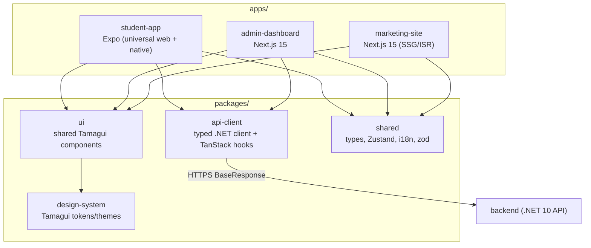
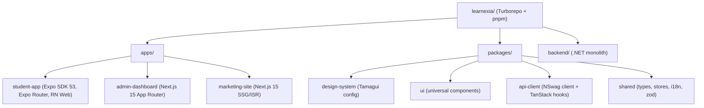
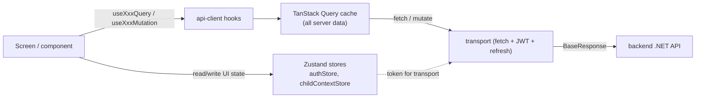
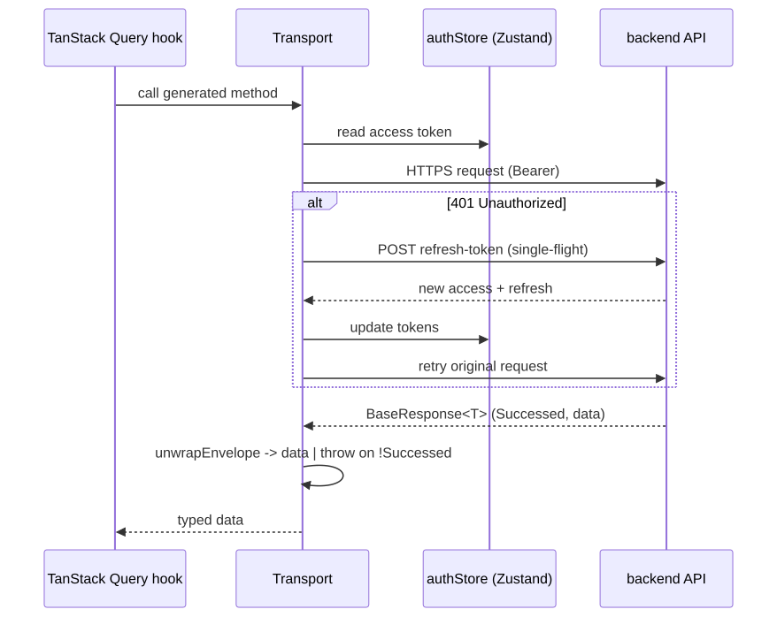
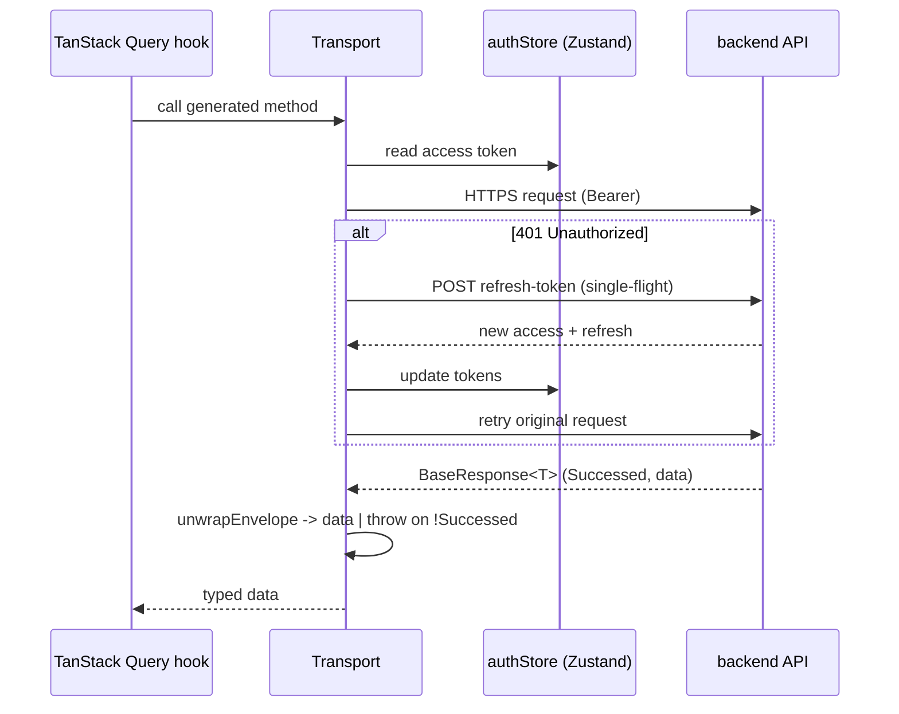
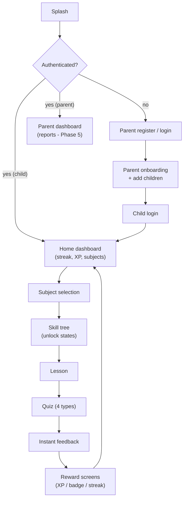

# Learnexia — Frontend Architecture (planned)

> **STATUS: PLANNED — not yet built.** Every component in this document is a design decision, not
> shipped code. The frontend is the open scope; the backend (Phases 1–3) is delivered. Treat each
> diagram as the *intended* shape.
> **Audience:** frontend engineers + the solo full-stack dev who will build it.
> **Scope:** the planned Turborepo monorepo — Expo universal student app, Next.js admin/marketing,
> shared packages, and how they consume the .NET backend.
> **Sources:** [../dev/FRONTEND_ARCHITECTURE.md](../dev/FRONTEND_ARCHITECTURE.md) (decision of record,
> 2026-05), [../../design-system/](../../design-system/), [../../tasks/](../../tasks/) (Frontend tasks).
> **Backend it talks to:** [backend-architecture.md](backend-architecture.md),
> [technical-architecture.md](technical-architecture.md).

---

## 1. High-Level — why this shape

Two very different frontend surfaces drive the structure:

- **Student experience** — gamified, animation-heavy, kid-facing; must run on **web (laptop/tablet)**
  *and* **native mobile** (a co-priority). Built **once** as a universal **Expo** app
  (React Native + React Native Web) so one person can maintain it.
- **Admin + marketing** — data-dense admin and a public SEO site, exactly where RN-Web is weak and
  **Next.js** is strong → separate Next.js apps.

Shared design tokens, UI components, the API client, and domain logic live in `packages/`. UI is
shared via **Tamagui**, which compiles the same components to Expo and Next.

Mermaid source — diagram 1

> **(planned)** Build order is gated on DevOps story P1-07 (monorepo skeleton) → P1-08 (design system
> + UI) → api-client + shared → student-app shell → feature screens.

---

## 2. Components — repository layout

Mermaid source — diagram 2

### 2.1 Package responsibilities

| Package | Owns |
|---|---|
| `design-system` | Tamagui `createTamagui()` config — colors (primary `#4F46E5`, success `#22C55E`, reward `#F59E0B`, danger `#EF4444`, badge `#A855F7`; bg `#0F172A`), spacing, radius, shadows/glow, fonts (Poppins / Cairo / Tajawal), media queries (`sm`, `tablet`=768, `laptop`=1024), light + dark themes |
| `ui` | Universal Tamagui components: `Button`, `Card`, `XPBar`, `Hearts`, `StreakFlame`, `Badge`, `AITutorBubble`, `RewardPopup`, `SkillNode`, `LessonCard`, `QuizCard`; naming `Component/Category/Variant` |
| `api-client` | Typed client to the .NET API (NSwag-generated from the Swagger v2 snapshot), `BaseResponse<T>`/`PaginatedResult<T>` envelope unwrap, JWT attach + single-flight refresh interceptor, TanStack Query hooks |
| `shared` | Domain types (Subject/Unit/Lesson/Concept/Skill, Attempt, StudentAnswer…), constants (`Roles`, grades 1–6, 4 subjects), zod schemas, i18n (ar/en) + RTL helpers, Zustand stores (`authStore`, `childContextStore`), utils |

### 2.2 App responsibilities

| App | Responsibility |
|---|---|
| **student-app** (Expo universal) | Everything a student or parent touches in Phases 1–5: splash, parent register/login, parent-driven onboarding + add children, child login, home dashboard, subject selection, skill tree, lesson, quiz, feedback, gamification screens, parent dashboard |
| **admin-dashboard** (Next.js) | Admin sign-in + shell start in Phase 1 (P1-10); data-heavy curriculum/content/moderation features in Phase 2+/Phase 7 |
| **marketing-site** (Next.js) | Public marketing + SEO (SSG/ISR); not in the MVP feature phases |

---

## 3. Low-Level — toolchain & cross-cutting design

### 3.1 Toolchain

| Need | Choice |
|---|---|
| Monorepo | Turborepo + pnpm workspaces |
| Language | TypeScript (strict) everywhere |
| Student app | Expo SDK 53, RN 0.76+ (New Arch), Expo Router, RN Web |
| Admin / marketing | Next.js 15 App Router |
| Shared UI | Tamagui (+ `@tamagui/next-plugin`) |
| Animation | Reanimated 3 + Moti + React Native Skia |
| Client state | Zustand v5 |
| Server state | TanStack Query v5 |
| Forms / validation | react-hook-form + zod (schemas shared in `shared`) |
| i18n | react-i18next (ar/en, RTL) |
| Testing | Jest + RN Testing Library (app), Vitest (packages), Playwright (web), Maestro (native E2E) |

### 3.2 State split — Zustand vs TanStack Query

**Rule:** Zustand holds client/UI state only; **all server data lives in TanStack Query** (never in
Zustand). No API calls inside components — go through `api-client` hooks.

Mermaid source — diagram 3

### 3.3 API client — generation & request lifecycle

`api-client` is generated, not hand-written: **NSwag** consumes the committed Swagger v2 snapshot from
the running backend (`refresh:swagger` → `gen:api` emits the typed client + DTOs). Hooks wrap the
generated methods, unwrap the `BaseResponse<T>` envelope, and share a single-flight 401-refresh
transport. The generated client is committed; never hand-edit `src/generated/**`.

Mermaid source — diagram 4

### 3.4 RTL / i18n & theming

- **RTL-first:** `react-i18next` + Tamagui logical props; Arabic is the default. On native, switching
  LTR↔RTL requires an app reload (`react-native-restart`) — design the language-switch UX around that.
- **Fonts:** Cairo / Tajawal (ar), Poppins (en).
- **Theming:** one Tamagui config in `design-system`; Expo loads it via Metro, Next via
  `@tamagui/next-plugin`. Default theme is the dark game-world palette; tokens drive every component.
- **Token storage:** abstracted in `shared` — `expo-secure-store` on native, secure cookie / web
  storage on web.
- **Responsive web:** media queries at 390 (phone), 768 (tablet), 1024+ (laptop); max-width
  containers; web-only hover/focus states.

---

## 4. Services — navigation / screen map (student-app)

Mermaid source — diagram 5

### 4.1 Build order (planned)

1. Turborepo + pnpm skeleton (depends on P1-07).
2. `design-system` Tamagui config → `ui` core components (P1-08).
3. `api-client` + `shared` (auth store, i18n, types).
4. `student-app` shell: Expo Router, theme + i18n/RTL providers, responsive layout.
5. Feature screens in Phase 1 → Phase 2 → Phase 3 (gamification) order.

---

## 5. Conventions (planned)

- Reusable visuals → `packages/ui`; tokens/theme → `packages/design-system`; anything that calls the
  API → `packages/api-client`; types/stores/validation/i18n → `packages/shared`; screens → `apps/*`.
- **No API calls in components**; **no server data in Zustand.**
- Imports use workspace aliases (`@learnexia/ui`, `@learnexia/api-client`, …).
- Components follow `Component/Category/Variant`; screens are Expo Router route files.
- **Design patterns — ask first** (same rule as backend): mirror existing component/hook shapes; do
  not introduce new abstractions unilaterally.

## 6. Open questions

- RTL language-switch UX on native (reload requirement).
- Token storage abstraction details across native/web.
- Whether the parent dashboard's richer analytics eventually moves to `admin-dashboard` (Phase 5).
- Tamagui compiler setup time — the steepest part of the stack; budget for it.

---

## Related documents

- [../dev/FRONTEND_ARCHITECTURE.md](../dev/FRONTEND_ARCHITECTURE.md) — frontend decision of record
- [backend-architecture.md](backend-architecture.md) — the API this frontend consumes
- [technical-architecture.md](technical-architecture.md) — backend cross-cutting design (envelope, auth)
- [business-architecture.md](business-architecture.md) — capabilities + value streams
- [../../tasks/](../../tasks/) — Frontend task breakdown (`student-app/` + `packages/`)
