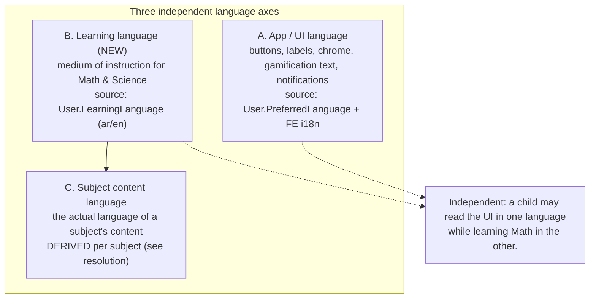
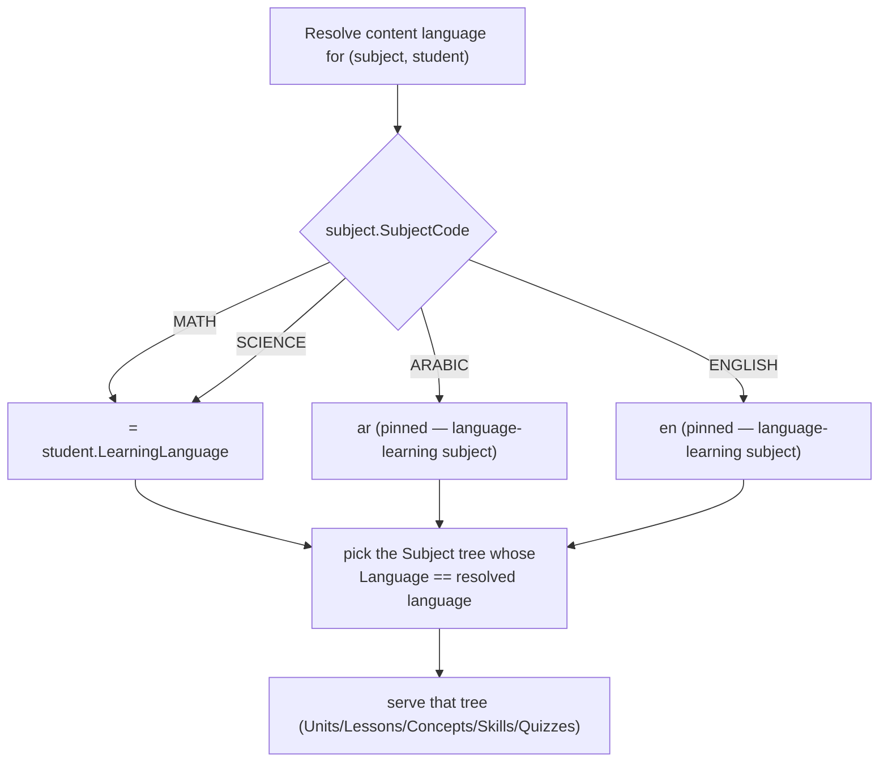
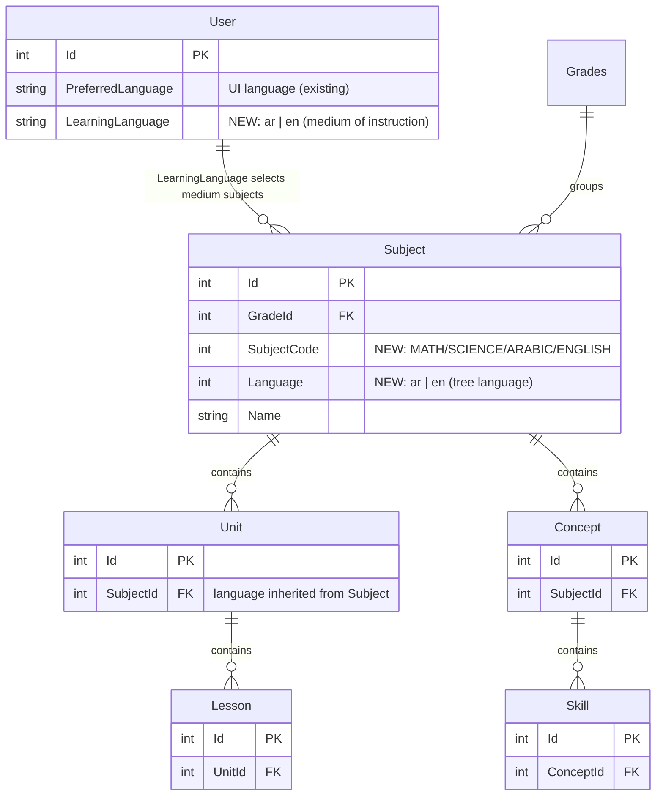
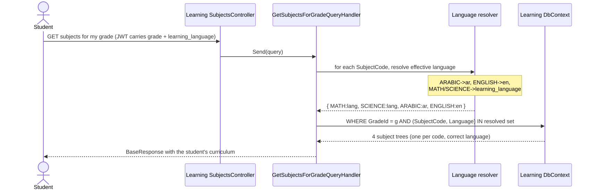
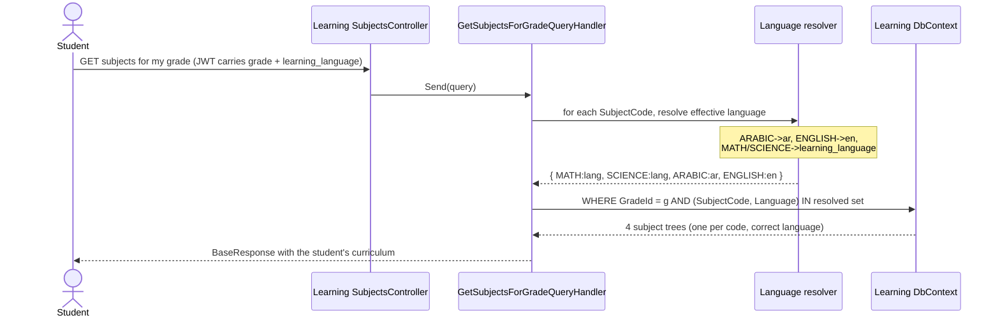
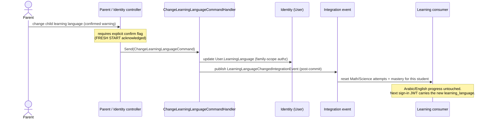
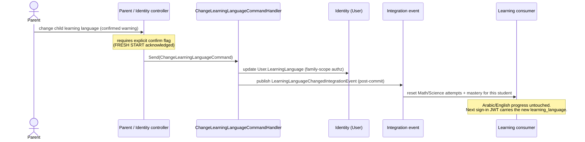

# Learnexia — Localization Architecture (learning language vs UI language)

> **Audience:** backend + frontend engineers and the product lead.
> **Scope:** how Learnexia handles language across three independent axes, and specifically how a
> student's **learning language** (medium of instruction) selects curriculum content — including the
> Arabic/English subject edge case.
> **Status:** design of record for **Phase 8 — Localization**. Supersedes the earlier "translate every
> curriculum row" idea (paired ar/en columns) for curriculum content.
> **Sources:** [../../CLAUDE.md](../../CLAUDE.md), [backend-architecture.md](backend-architecture.md),
> [../dev/CONVENTIONS.md](../dev/CONVENTIONS.md), the Learning entities + `LearningSeeder`.

---

## 1. Three independent language axes

These must not be conflated. Each is decided separately.

Mermaid source — diagram 1

- **A. App/UI language** — existing `User.PreferredLanguage` (default `ar-EG`) + `IStringLocalizer`
  backend + react-i18next frontend. **Unchanged by this phase.**
- **B. Learning language** — **new** `User.LearningLanguage` (`ar` | `en`). Set by the **parent at
  onboarding**, immutable by the student, changeable **only by the parent** (rare, fresh-start —
  see §5).
- **C. Subject content language** — never stored on the student; **derived** from the subject + the
  student's learning language (§2).

---

## 2. The resolution rule (handles the Arabic/English edge case)

Each `Subject` carries a stable `SubjectCode`. Content language is resolved per subject:

Mermaid source — diagram 2

So for the **same grade**:

| Subject | Arabic-medium student sees | English-medium student sees |
|---|---|---|
| Math | Math **(ar)** | Math **(en)** |
| Science | Science **(ar)** | Science **(en)** |
| Arabic | Arabic **(ar)** | Arabic **(ar)** |
| English | English **(en)** | English **(en)** |

**Both school types take both language subjects.** Arabic and English subjects are identical for both
students — their language comes from the subject, not the student. Fallback if a resolved tree is
missing: fall back to the other language tree and log (should not happen once both are seeded).

---

## 3. Data model

No per-row translation columns. Curriculum content lives as **parallel trees rooted at a
language-specific `Subject`**; language is carried only on `Subject` and inherited by everything below
it.

Mermaid source — diagram 3

Per grade the seeder authors **6 Subject roots** (instead of 4): `MATH/ar`, `MATH/en`, `SCIENCE/ar`,
`SCIENCE/en`, `ARABIC/ar`, `ENGLISH/en`.

> `User.LearningLanguage` lives in the **Identity** schema; the Learning module never FKs to it — it
> reads the value from a **JWT claim** (`learning_language`) on the authenticated student, consistent
> with how Learning already reads the student id from the token.

---

## 4. Read path — serving the right tree

Mermaid source — diagram 4

The same resolution applies to skill-tree, lessons-in-unit, quiz, and dashboard queries — anywhere a
subject's content is read for a student.

---

## 5. Changing the learning language (parent-only, fresh start)

The learning language is **immutable by the student** and changeable **only by the parent**, with an
explicit fresh-start warning. It happens rarely, normally only at the **start of a school year**.
Switching changes which Math/Science trees the child sees, so their **Math/Science progress no longer
maps and is reset**; Arabic/English subjects are unaffected.

Mermaid source — diagram 5

> **Module isolation:** the change happens in Identity (the `User` field) and fans out to Learning via
> a `Shared.Contracts` integration event — no cross-module FK, dispatched after commit per
> [../dev/adr/0002-domain-events-and-dispatch.md](../dev/adr/0002-domain-events-and-dispatch.md).

---

## 6. Locked product decisions

1. `LearningLanguage` is a **separate field** from `PreferredLanguage` (medium ≠ UI language).
2. **Student cannot change** it; **parent only**, behind an explicit fresh-start warning; rare,
   start-of-year.
3. **Both school types take both language subjects** (Arabic-medium students still study English, and
   vice-versa).
4. Curriculum content uses **parallel language trees keyed by `Subject.Language`**, not per-row
   translations.

## 7. Open / to-confirm during build

- **Fresh-start scope:** confirm reset covers Math/Science **Learning** attempts + mastery only;
  global gamification (XP/streak/badges) is engagement and is **retained**.
- **Onboarding default:** default the UI `PreferredLanguage` to match the chosen `LearningLanguage`,
  but keep them editable independently.
- Whether `SubjectCode` should also drive ordering/iconography (likely yes, FE concern).

---

## Related documents

- [backend-architecture.md](backend-architecture.md) — modules, schemas, integration events
- [technical-architecture.md](technical-architecture.md) — pipeline, domain-event dispatch, isolation
- [business-architecture.md](business-architecture.md) — capabilities, value streams
- Phase 8 stories/tasks: `user-stories/Phase-8-Localization/`, `tasks/Backend/Phase-8-Localization/`
