# Learnexia — Technical Architecture (cross-cutting)

> **Audience:** engineers and architects working across modules.
> **Scope:** the cross-cutting technical design of the `backend/` modular monolith
> (`Learnexia.Modular.sln`) — composition, request lifecycle, persistence, eventing, security, ops.
> Per-module detail is in [backend-architecture.md](backend-architecture.md); the business view is in
> [business-architecture.md](business-architecture.md).
> **Sources (verified against code):** [../../CLAUDE.md](../../CLAUDE.md),
> [../dev/CONVENTIONS.md](../dev/CONVENTIONS.md), [../dev/FEATURE_PLAYBOOK.md](../dev/FEATURE_PLAYBOOK.md),
> [../dev/adr/0001-unit-of-work.md](../dev/adr/0001-unit-of-work.md),
> [../dev/adr/0002-domain-events-and-dispatch.md](../dev/adr/0002-domain-events-and-dispatch.md),
> backend `src/`.
>
> **Note:** the older [../architecture.md](../architecture.md) predates the Learning/Gamification/Parent
> modules and still describes a 3-module SQL-Server setup. **This document supersedes it** for the
> current state: PostgreSQL, 6 modules, deferred-commit + domain-event dispatch.

---

## 1. High-Level Architecture (HLD)

A single deployable **Host** (`Learnexia.Host`, ASP.NET Core 10) composes **five self-contained
modules** plus three shared libraries. Each module owns its API, application logic, domain, and
persistence (its own PostgreSQL **schema** in one shared database). **Modules never reference each
other's projects** — they communicate only through `Shared.Contracts` (integration events + interface
seams). See [../dev/CONVENTIONS.md](../dev/CONVENTIONS.md) §12. (The demo **Catalog** module was
removed 2026-06-03; **Learning** is now the reference shape.)


<details>
<summary>Mermaid source — diagram 1</summary>

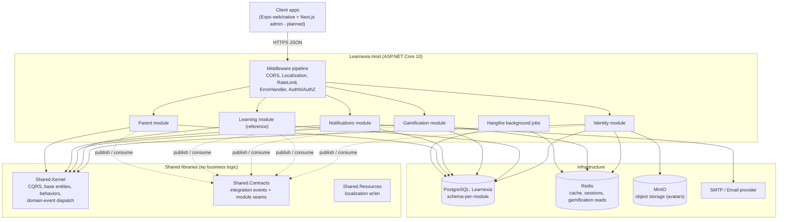

</details>

### 1.1 Technology stack

| Concern | Technology |
|---|---|
| Runtime / framework | **.NET 10**, ASP.NET Core, modular monolith |
| Persistence | **PostgreSQL** via **EF Core 10** + **Npgsql** (`UseNpgsql`), one schema per module, DB `Learnexia` |
| Application pattern | **CQRS** via **MediatR 12**, **FluentValidation 12**, **AutoMapper 16** |
| Auth | **ASP.NET Core Identity** (int keys) + **JWT bearer**; permission-claim policies |
| Caching / state | **Redis** via `IDistributedCache` (in-memory fallback in dev) |
| Background jobs | **Hangfire** (streak sweeps, mission/league rollovers, cache rebuild, nudges) |
| Object storage | **MinIO** (avatar upload, `IFilePreviewUrlProvider` seam) |
| Email / push | SMTP adapter (`IEmailSender`) + dev log sink; Firebase Admin packages present |
| Eventing | In-process **domain events** + **integration events** (MediatR `INotification`) |
| Localization | `IStringLocalizer<SharedResources>`, ar/en |
| Logging / telemetry | **NLog** via `ILoggerManager`; OpenTelemetry packages referenced |
| API surface | MVC controllers + minimal endpoints; Swagger v2; API versioning |
| Anti-abuse | `AspNetCoreRateLimit` (IP), Cloudflare **Turnstile** CAPTCHA (config-gated) |
| Testing | xUnit + Moq + FluentAssertions + **Testcontainers** (PostgreSQL) |

---

## 2. Low-Level Architecture (LLD)

### 2.1 Module four-layer structure

Every module has four projects in a Clean/Onion arrangement; `Application` and `Domain` have **no
outward dependencies** ([../dev/CONVENTIONS.md](../dev/CONVENTIONS.md) §1).


<details>
<summary>Mermaid source — diagram 2</summary>

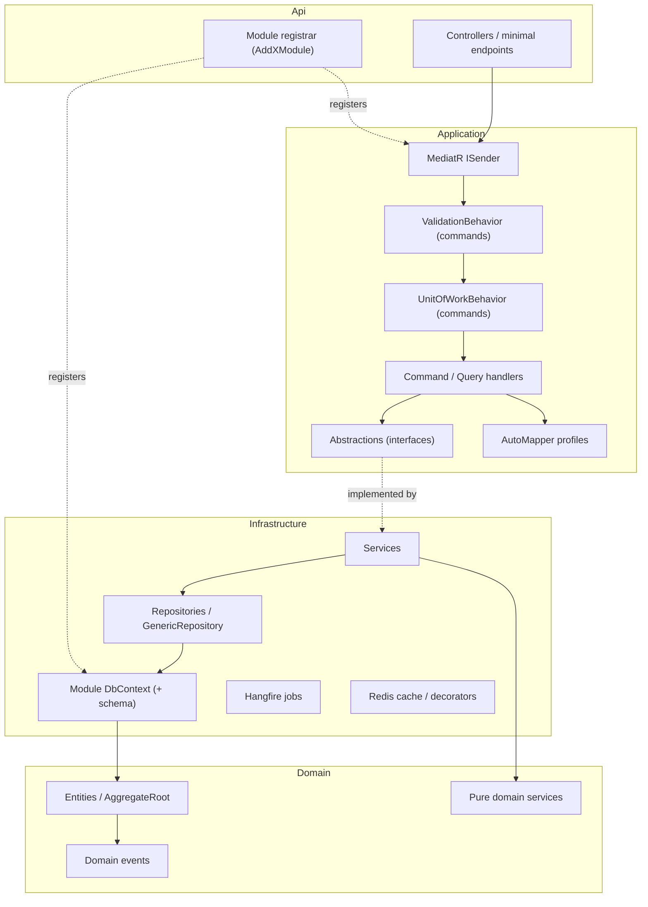

</details>

Dependency direction: `Api → Application → Domain`; `Infrastructure → Application + Domain`. Reference
implementation = **Learning** (the removed Catalog module was the original reference); all modules use
the deferred-commit Unit-of-Work behavior (§2.4).

### 2.2 Request pipeline (MediatR behaviors)

Every request flows through MediatR. `ValidationBehavior` and `UnitOfWorkBehavior` run **only for
commands** (`ICommand<>`); queries skip both.

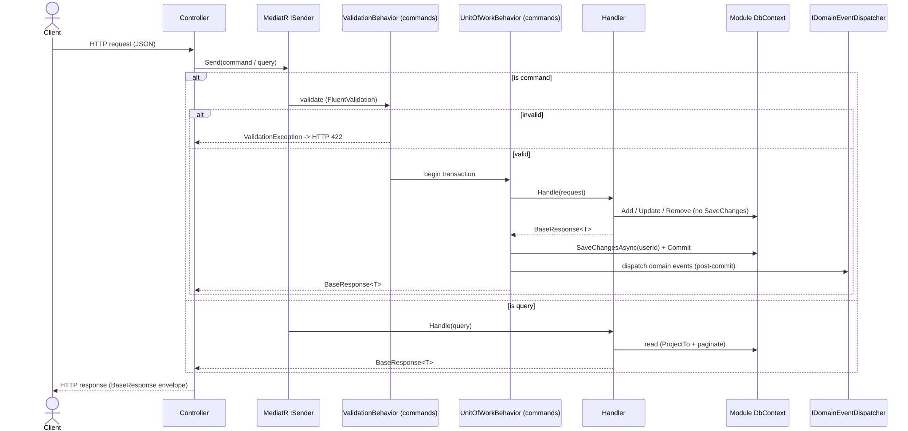

<details>
<summary>Mermaid source — diagram 3</summary>

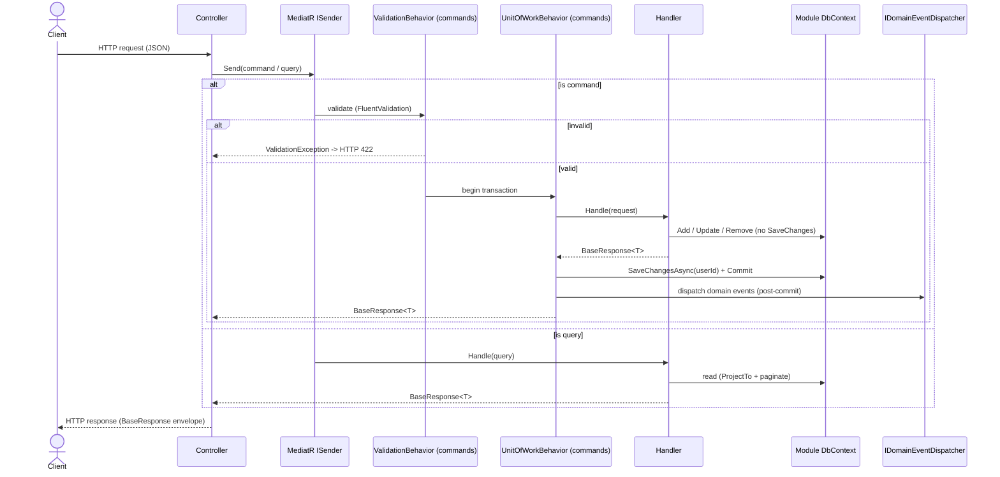

</details>

### 2.3 Response envelope

All controller actions return the uniform `BaseResponse<T>` envelope; paged endpoints return
`PaginatedResult<T>`. Controllers convert with `NewResult(...)`; handlers build responses via
`BaseResponseHandler`. **The success flag is spelled `Successed`** (do not rename — clients depend on
the JSON key). Validation failures are shaped as **HTTP 422**.

```jsonc
{
  "statusCode": 200,
  "successed": true,        // spelled "Successed" in source
  "message": "Successfully.",
  "data": { },
  "errors": []
}
```

Status mapping: `Success`→200, `Created`→201, `BadRequest`→400, `Unauthorized`→401, `NotFound`→404,
`BusinessValidation`→424, `ServerError`→500.

### 2.4 Persistence & Unit of Work (ADR 0001)

- **One `DbContext` + one PostgreSQL schema per module** (`identity`, `learning`, `gamification`,
  `notifications`, `parent`), one DB (`Learnexia`). Per-module `MigrationsHistoryTable`.
- **No cross-module foreign keys.** `CreatedBy` etc. are plain `int` values, not FKs to
  `identity.AspNetUsers`.
- **Deferred commit (all modules):** repositories only `Add/Update/Remove`; a
  `UnitOfWorkBehavior<TRequest,TResponse>` opens a transaction, runs the handler, calls
  `SaveChangesAsync` once, and commits — rolling back on exception. (The removed Catalog module was
  the lone exception, committing per repository call.)
- **Transaction scope = one module DbContext.** Never span modules in a transaction; cross-module
  consistency uses integration events published **after** commit.

### 2.5 Domain events & dispatch (ADR 0002)

Domain events are raised by `AggregateRoot`s and dispatched **only after a successful commit**, then
cleared. Cross-module fan-out works because MediatR is registered once at the Host across all module
Application assemblies, behind an **`IsolatedNotificationPublisher`** — one failing handler does not
abort its siblings.

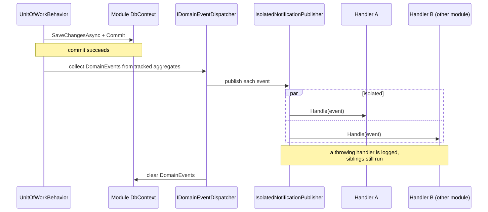

<details>
<summary>Mermaid source — diagram 4</summary>

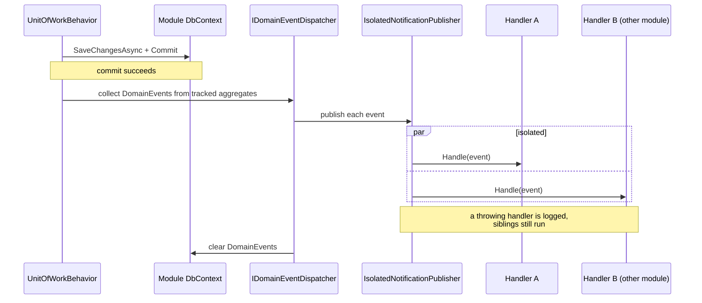

</details>

> **Integration events** (`IIntegrationEvent : INotification`) are the cross-module contract — a
> publishing module raises a contract event and never references the consumer. Synchronous
> cross-module reads use **interface seams** (e.g. `IStudentXpQuery`, `IParentChildQuery`,
> `IUserLookup`). Full catalog in [backend-architecture.md](backend-architecture.md) §5.

---

## 3. Components

| Component | Responsibility | Key paths |
|---|---|---|
| **Learnexia.Host** | Composition root: pipeline, module registration, controller mapping, Hangfire, seeding | `backend/src/Host/Learnexia.Host/Program.cs` |
| **Host middleware** | Error handling, authz logging, rate limiting, localization, response caching | `backend/src/Host/Learnexia.Host/Middleware/` |
| **5 feature modules** | Identity, Learning, Gamification, Notifications, Parent | `backend/src/Modules/<Module>/` |
| **Shared.Kernel** | CQRS markers, base/audited entities, `AggregateRoot`, `ValidationBehavior`, `UnitOfWorkBehavior`, domain-event dispatch, `BaseResponse`, pagination | `backend/src/Shared/Learnexia.Shared.Kernel/` |
| **Shared.Contracts** | Integration events + cross-module interface seams | `backend/src/Shared/Learnexia.Shared.Contracts/` |
| **Shared.Resources** | Localization (ar/en) | `backend/src/Shared/Learnexia.Shared.Resources/` |
| **PostgreSQL** | Single DB, schema-per-module | connection string `Default` |
| **Redis** | Sessions, token cache, gamification read model | Identity + Gamification infrastructure |
| **MinIO** | Avatar/object storage | `IFilePreviewUrlProvider` seam |
| **Hangfire** | Scheduled jobs (streaks, missions, leagues, nudges, cache rebuild) | Gamification + Notifications infrastructure |

---

## 4. Cross-cutting Services

### 4.1 Middleware pipeline

Order matters: the error handler wraps everything downstream, authentication precedes authorization.


<details>
<summary>Mermaid source — diagram 5</summary>

```mermaid
flowchart LR
    req["Request"] --> cors["UseCors"]
    cors --> swag["Swagger"]
    swag --> loc["RequestLocalization"]
    loc --> fwd["ForwardedHeaders + HSTS"]
    fwd --> err["ErrorHandlerMiddleware"]
    err --> authlog["AuthorizationLoggingMiddleware"]
    authlog --> rate["IP Rate Limiting"]
    rate --> cache["ResponseCaching"]
    cache --> authn["Authentication (JWT)"]
    authn --> authz["Authorization (policies)"]
    authz --> map["MapControllers + module endpoints"]
    map --> res["Response (BaseResponse)"]
```

</details>

### 4.2 Security architecture

| Control | Implementation | Notes |
|---|---|---|
| **Authentication** | JWT bearer; validates issuer/audience/lifetime/signing key (HMAC); secret guarded out of source in non-Dev | `RequireHttpsMetadata=false` not yet env-gated → P6-06 |
| **Account protection** | Lockout engaged (5 attempts / 5 min); sign-in collapses not-found/wrong-password to one result (no enumeration) with a timing-oracle guard | Identity `SignInCommandHandler` |
| **Anti-automation** | IP rate limiting + Cloudflare Turnstile CAPTCHA (config-gated, fail-closed in prod/staging) | `ICaptchaVerifier` |
| **Authorization** | Permission-claim policies `{Module}.{Action}` + roles; **family-scope** handler restricts parents to their own children | applied deliberately per endpoint |
| **Secrets** | JWT secret, email, admin seed, OAuth, CAPTCHA keys from env / config, never committed | admin seeded from `AdminSeed:*` |
| **Transport / CORS** | HSTS, forwarded headers, named CORS policy with explicit origins | |
| **Child-data isolation** | Module isolation + no cross-module FK + family-scope authz | [../dev/CONVENTIONS.md](../dev/CONVENTIONS.md) §12 |

### 4.3 Caching & Redis read model

Gamification serves hot reads (XP, streak, hearts, leaderboards) from Redis using a **cache-aside
snapshot** model: per-seam JSON snapshots with DEL-on-domain-event invalidation, plus a sorted-set
leaderboard for leagues. PostgreSQL remains the durable source of truth; invalidation forces re-read,
so contention cannot lose XP. A nightly `GamificationCacheRebuildJob` reconciles drift.

### 4.4 Background jobs (Hangfire)

| Job | Schedule (UTC) | Purpose |
|---|---|---|
| `StreakSweepJob` | daily | Break/roll streaks; consume streak freezes |
| `MissionRolloverJob` | daily + weekly | Reset daily/weekly mission instances |
| `LeagueRolloverJob` | Monday 00:15 | Promote/demote league cohorts |
| `TimedEventSweepJob` | every 2 min | Activate/expire timed events |
| `StreakAtRiskJob` / `LapseWinBackJob` | daily | Re-engagement nudges |
| `GamificationCacheRebuildJob` | nightly | Reconcile Redis read model vs PostgreSQL |

### 4.5 Localization, logging, observability

- **Localization:** `IStringLocalizer<SharedResources>` with `SharedResourcesKey.*` (ar/en).
- **Logging:** inject `ILoggerManager` (NLog wrapper), not `ILogger<T>`.
- **Observability:** OpenTelemetry packages referenced; full tracing/metrics pipeline is **(planned)**
  for Phase 6 (P6-05).

---

## 5. Deployment / Runtime Topology

Single API process plus PostgreSQL, Redis, and MinIO. Hangfire runs in-process in the Host.


<details>
<summary>Mermaid source — diagram 6</summary>

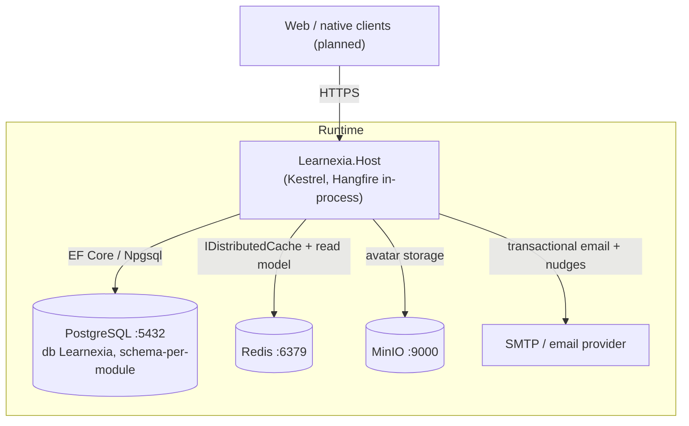

</details>

> **(ops note)** The committed `docker-compose` historically provisioned SQL Server and lags the
> PostgreSQL migration; confirm the compose file targets a `postgres` service before relying on
> `docker compose up`. The staging deploy provider is an **open decision**
> ([../deploy/staging-decision.md](../deploy/staging-decision.md)).

---

## 6. Conventions that bind every module

1. **Module isolation** — no project references across modules; cross-module via `Shared.Contracts` only; no cross-module FK.
2. **Response envelope** — `BaseResponse<T>` via `BaseResponseHandler`; controllers use `NewResult(...)`; success flag `Successed`.
3. **Unit of Work** — all modules use deferred commit + `UnitOfWorkBehavior` (ADR 0001).
4. **Domain events** — dispatched post-commit via `IsolatedNotificationPublisher` (ADR 0002).
5. **Validation** — `ValidationBehavior` runs for `ICommand<>` only; queries are not auto-validated.
6. **Logging** — inject `ILoggerManager`, not `ILogger<T>`.
7. **Design patterns — ask first.** Mirror existing shapes; do not introduce new patterns unilaterally.

---

## Related documents

- [business-architecture.md](business-architecture.md) — business/domain view
- [backend-architecture.md](backend-architecture.md) — per-module deep dive + ER diagrams + flows
- [frontend-architecture.md](frontend-architecture.md) — planned frontend architecture
- [../dev/CONVENTIONS.md](../dev/CONVENTIONS.md) · [../dev/FEATURE_PLAYBOOK.md](../dev/FEATURE_PLAYBOOK.md)
- [../dev/adr/0001-unit-of-work.md](../dev/adr/0001-unit-of-work.md) · [../dev/adr/0002-domain-events-and-dispatch.md](../dev/adr/0002-domain-events-and-dispatch.md)
- [../architecture.md](../architecture.md) — original backend reference (partly stale; superseded here)
